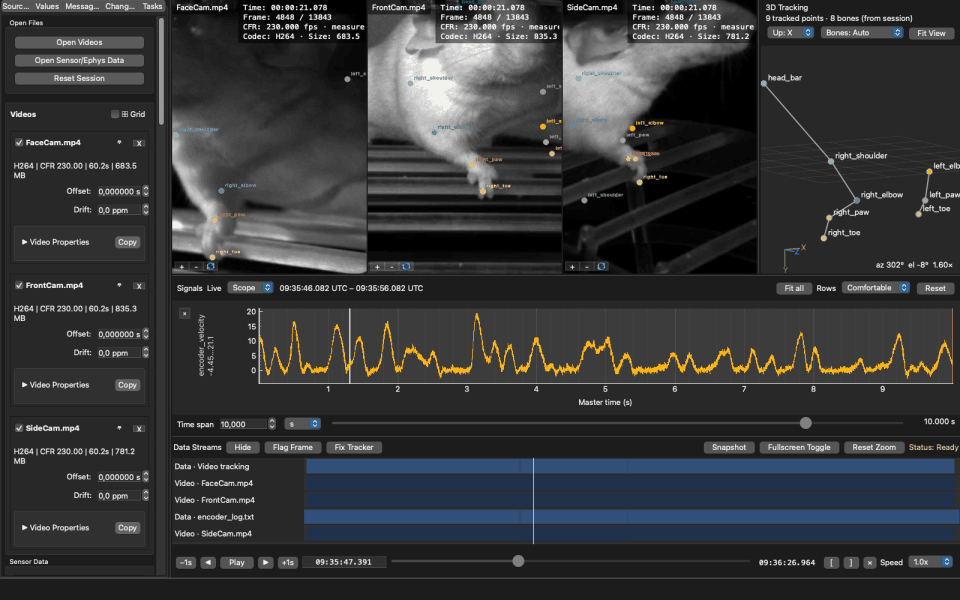

AvialSync documentation
==========================

The Advanced Video and Instrument Alignment Library.

AvialSync helps you inspect video and time-stamped experiment recordings on one shared timeline.
It is for looking carefully at data, checking alignment, and preparing observations for analysis.

         overlays, a 3D pose view, and the wheel encoder velocity trace advancing together on one
         master timeline.
   :width: 100%

*Three cameras at 230 fps with per-camera 2D pose, triangulated 3D pose, and wheel-encoder
velocity — one second of it, at the speed it was recorded, every source moving on one master
clock. The folder was opened by dropping it on the window; a session plugin recognised the
layout.*

.. toctree::
   :maxdepth: 2
   :caption: Guides

   quickstart
   user-guide/index
   tutorials/first-session
   tutorials/synchronization
   formats
   troubleshooting

.. toctree::
   :maxdepth: 2
   :caption: Extending and internals

   plugin-guide
   technical/index
   licensing
