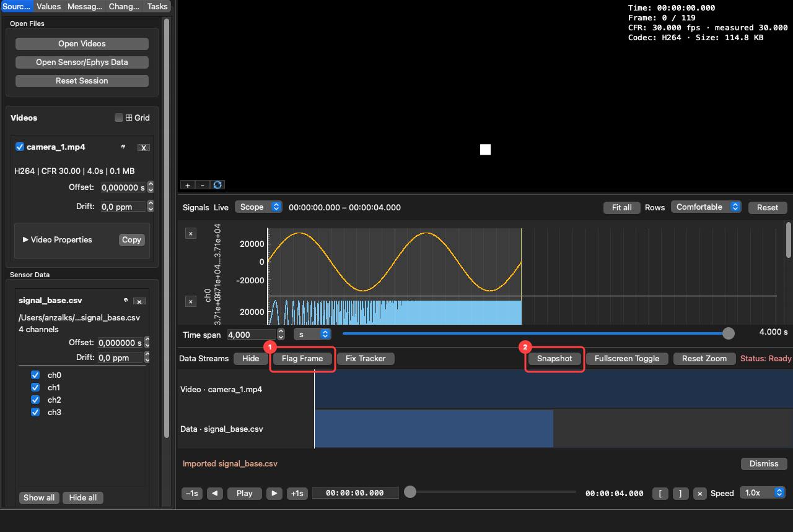
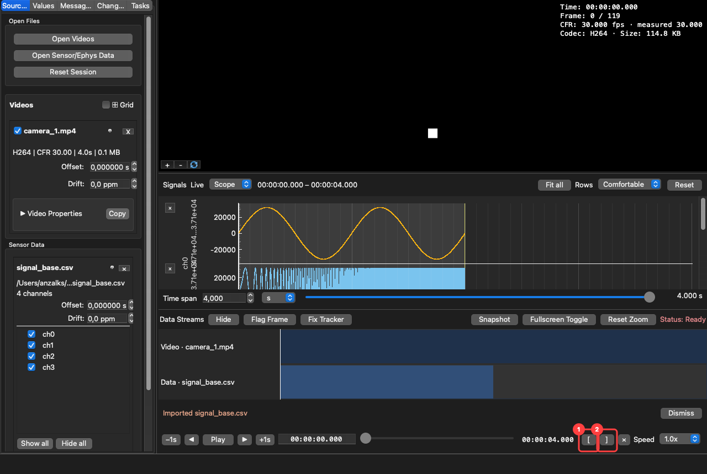

# Tutorial: flag frames and export

This covers marking moments in a recording — a dropped tracking point, a bad frame, an event worth
returning to — and getting them, or the media around them, out of AvialSync.

The frame-flagging workflow exists for a specific job: **producing a corrections list for retraining
a pose model**. The exported CSV names the exact frame in each camera, which is what a tool like
DeepLabCut or LightningPose needs to be told what to fix.

## Flag a frame

1. **Flag Frame** (shortcut `M`) records an annotation at the current time.
2. **Snapshot** (`Ctrl+E`) writes a composed figure of the current moment.

You can also click directly on a plot at the moment you care about, which adds a marker there
without moving the playhead first.

**What a flag actually stores.** Not just a timestamp: for every video loaded at that moment,
AvialSync records the file path, the exact frame index, and that frame's own presentation timestamp.
That is the point — "2.47 seconds" is ambiguous across four cameras with different offsets and
frame rates, while "camera_2.mp4, frame 74" is not. This is why the frame the app displays and the
frame number it reports are resolved by the same lookup: they cannot disagree.

## Mark a range

1. **`[`** sets the start of a range at the current time.
2. **`]`** sets the end.

Use `×` to clear it. A range is what the clip and data-slice exports operate on, and it also drives
A/B loop playback for reviewing the same span repeatedly.

## Review and label what you flagged

The **Changes** tab in the left panel lists everything you have marked, in time order, alongside any
tracking corrections you have made. Double-click a row's label to name it — `occluded`, `bad_paw`,
`stim_onset`, whatever your analysis needs. **Delete** removes the selected row, and `Ctrl+Z` puts
it back.

## Export

Everything is under **File**, and each export is a distinct job:

| Export | What you get | Use it for |
|---|---|---|
| **Export Changes…** | One row per (marker, camera): `label`, `comment`, `t_master`, `video_path`, `frame_index`, `media_timestamp` — and, where you corrected tracking, the corrected pose data and a DeepLabCut retraining set | A corrections list for pose-model retraining |
| **Export Snapshot…** | A composed figure of the current moment | Figures, notes, lab reports |
| **Export Trimmed Video Clip…** | The marked range, copied out of the source | Sharing a moment without re-encoding it |
| **Export Data Slice…** | The marked range of the loaded signals | Analysis in another tool |

**Export Changes…** is also the **Export…** button in the Changes tab; it is one action, so the two
cannot offer different things. It lists only the recordings that actually have something to export,
and nothing is written until you choose it. [Correcting a tracked
point](../user-guide/index.md#correcting-a-tracked-point) covers the pose outputs in full.

**An export that has nothing to work on is greyed out, and says why.** Export Data Slice needs
loaded signals, Export Trimmed Video Clip needs a video and a marked A/B range, Export Snapshot
needs something on screen. Hover a greyed item and its tooltip names what is missing, so you find
out before you commit to the gesture rather than after.

**Exports run in the background and report when they finish.** Each one appears in the **Tasks**
tab beside the sidebar while it runs, with a Cancel in the status area, and the result arrives as a
line at the bottom of the window rather than a dialog you have to dismiss. If several finish at
once they queue: one message shows, a count beside it says how many are waiting, and Dismiss brings
up the next. A failure stays until you dismiss it and keeps the technical detail behind **Show
details**, ready to paste into a bug report.

**A snapshot is composed, not grabbed.** Every displayed camera goes in at the resolution it decoded
at, with the 3D pose and the whole channel stack including rows you would have to scroll to reach —
so nothing is cut off at a pane edge, and each camera is captioned with its own frame number,
timecode, and format.

A marker with no video loaded still exports, with the video columns left empty — so a flag is never
silently dropped for lack of a camera.

**Clips are copied, not re-encoded.** The exported video holds the original pixels rather than a
second generation of them, which matters when someone measures from it later. The cut is aligned to
the nearest keyframe at or before your start point, because a clip beginning mid-GOP would have no
frame to decode from.

## What is not exported

AvialSync does not write your analysis, and it never modifies a source recording. Offsets, drift,
accepted mappings, and annotations live in the session file (`.avv`) beside your data — so the
alignment a colleague sees is the one you accepted, with the evidence behind it.

Tracking corrections are the one thing kept outside the session, in `<pose file>.avialfix.csv` next
to the pose file, so they travel with the recording rather than with the session. Your pose files
themselves are still never modified.
