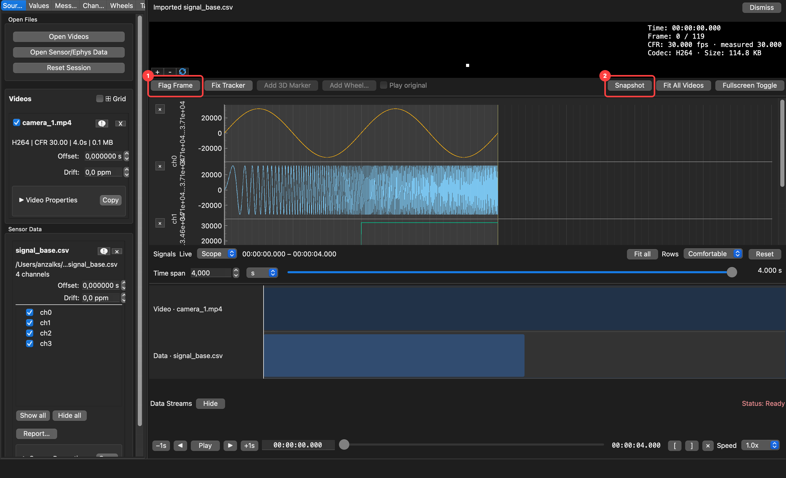
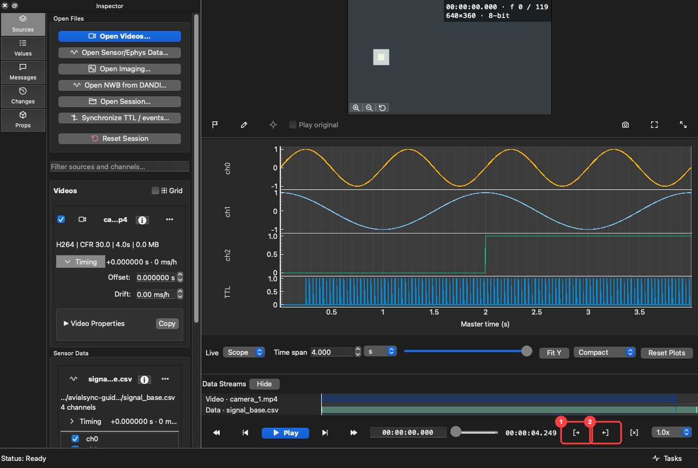
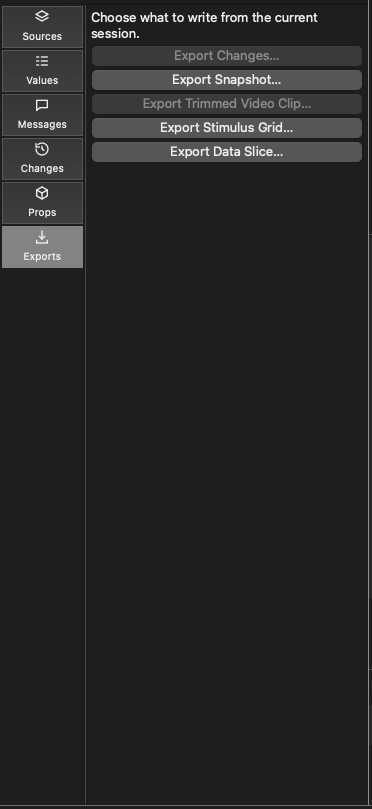
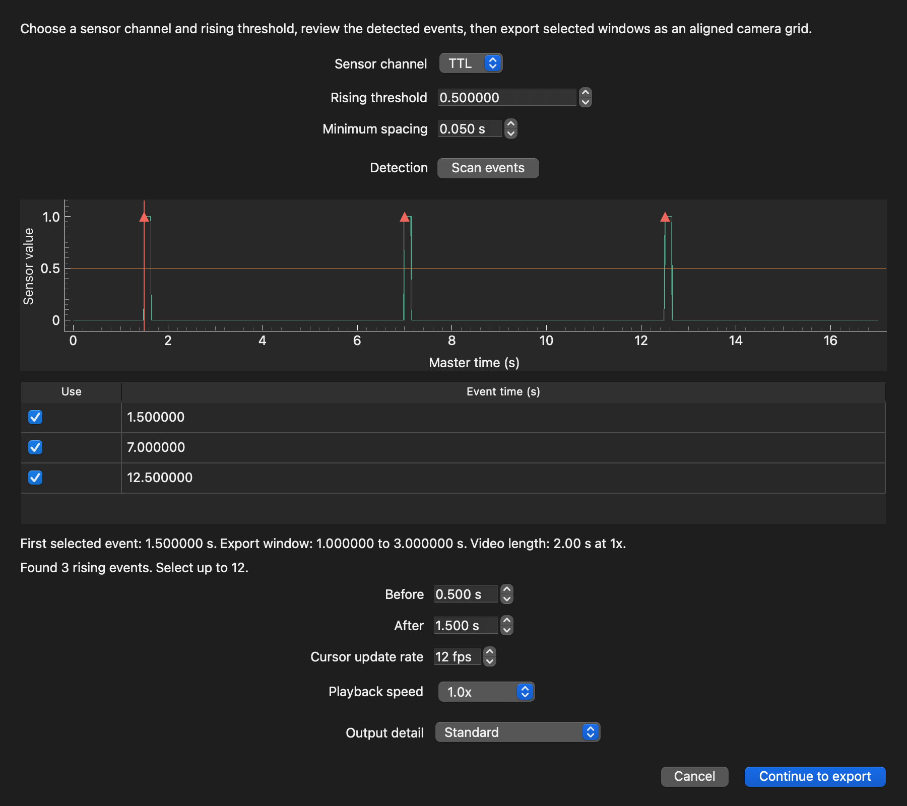
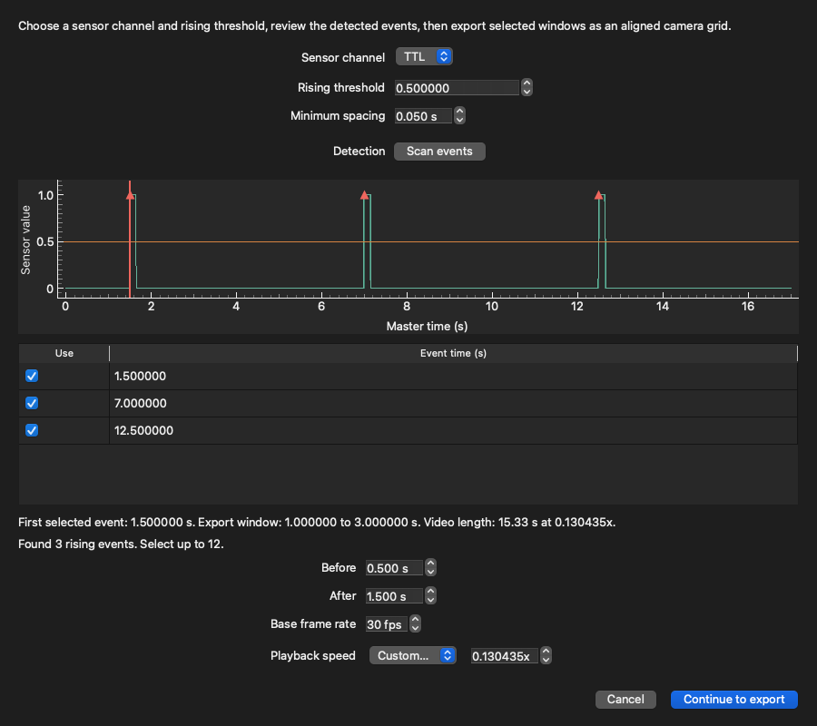
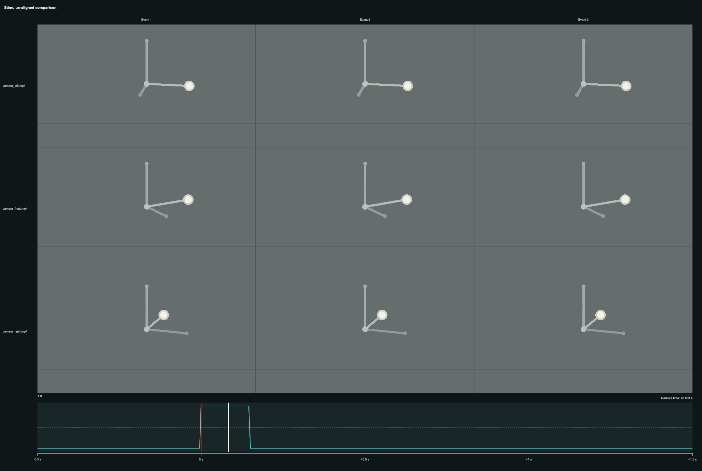

# Tutorial: flag frames and export

This covers marking moments in a recording — a dropped tracking point, a bad frame, an event worth
returning to — and getting them, or the media around them, out of AvialSync.

The frame-flagging workflow exists for a specific job: **producing a corrections list for retraining
a pose model**. The exported CSV names the exact frame in each camera, which is what a tool like
DeepLabCut or LightningPose needs to be told what to fix.

## Flag a frame

1. **Flag Frame** (shortcut `M`) records an annotation at the current time.
2. **Snapshot** (`Ctrl+E`) writes a composed figure of the current moment.

You can also click directly on a plot at the moment you care about, which adds a marker there
without moving the playhead first.

**What a flag actually stores.** Not just a timestamp: for every video loaded at that moment,
AvialSync records the file path, the exact frame index, and that frame's own presentation timestamp.
That is the point — "2.47 seconds" is ambiguous across four cameras with different offsets and
frame rates, while "camera_2.mp4, frame 74" is not. This is why the frame the app displays and the
frame number it reports are resolved by the same lookup: they cannot disagree.

## Mark a range

1. **`[`** sets the start of a range at the current time.
2. **`]`** sets the end.

Use `×` to clear it. A range is what the clip and data-slice exports operate on, and it also drives
A/B loop playback for reviewing the same span repeatedly.

## Review and label what you flagged

The **Changes** tab in the left panel lists everything you have marked, in time order, alongside any
tracking corrections you have made. Double-click a row's label to name it — `occluded`, `bad_paw`,
`stim_onset`, whatever your analysis needs. **Delete** removes the selected row, and `Ctrl+Z` puts
it back.

## Export

The **Exports** inspector page shows every output as a visible button. The same commands are in
**File** and the command palette; their labels and availability come from the same actions.

| Export | What you get | Use it for |
|---|---|---|
| **Export Changes…** | Annotation rows, one edited pose copy per source with corrections or accepted identity swaps, and a DeepLabCut retraining set when frames were hand-corrected | Analysis and pose-model retraining |
| **Export Snapshot…** | A composed figure of the current moment | Figures, notes, lab reports |
| **Export Trimmed Video Clip…** | The marked range, copied out of the source | Sharing a moment without re-encoding it |
| **Export Stimulus Grid…** | Selected sensor-triggered windows, arranged as camera rows and event columns above one shared signal trace and relative-time ruler | Comparing repeated stimuli across cameras and trials |
| **Export Data Slice…** | The marked range of the loaded signals | Analysis in another tool |

**Export Changes…** is also the **Export…** button in the Changes tab; it is one action, so the two
cannot offer different things. It lists only the recordings that actually have something to export,
and nothing is written until you choose it. [Correcting a tracked
point](../user-guide/index.md#correcting-a-tracked-point) covers the pose outputs in full.

**An export that has nothing to work on is greyed out, and says why.** Export Data Slice needs
loaded signals, Export Trimmed Video Clip needs a video and a marked A/B range, Export Snapshot
needs something on screen. Hover a greyed item and its tooltip names what is missing, so you find
out before you commit to the gesture rather than after.

**Exports run in the background and report when they finish.** Each one appears under **Tasks**
in the status bar while it runs, with a Cancel in the status area, and the result arrives as a
line at the bottom of the window rather than a dialog you have to dismiss. If several finish at
once they queue: one message shows, a count beside it says how many are waiting, and Dismiss brings
up the next. A failure stays until you dismiss it and keeps the technical detail behind **Show
details**, ready to paste into a bug report.
Each successful export has a **Reveal** action that opens its containing folder. The save dialog
remembers a separate last folder for each export kind. A failed or cancelled write leaves an
existing output intact, and a destination that names a loaded source or the disposable cache is
rejected before writing.

Exports carry an `avialsync` schema ID, program version, UTC write time, and source names and sizes
where their format permits it. Corrected pose and DeepLabCut retraining CSVs keep their strict
three-row headers and get a sibling `<name>_avialsync.json` provenance file. Annotation CSVs also
get a JSON companion. Data slice CSVs have a final provenance comment; Parquet embeds the record
in schema metadata; PNG snapshots carry PNG text fields; MP4 clips record their actual keyframe
start in the container comment. CSV files use UTF-8 without a BOM. A DeepLabCut workflow that
requires `CollectedData_<scorer>.h5` can run DeepLabCut's `convertcsv2h5` on the exported CSV.

**A snapshot is composed, not grabbed.** Every displayed camera goes in at the resolution it decoded
at, with the 3D pose and the whole channel stack including rows you would have to scroll to reach —
so nothing is cut off at a pane edge, and each camera is captioned with its own frame number,
timecode, and format.

A marker with no video loaded still exports, with the video columns left empty — so a flag is never
silently dropped for lack of a camera.

**Clips are copied, not re-encoded.** The exported video holds the original pixels rather than a
second generation of them, which matters when someone measures from it later. The cut is aligned to
the nearest keyframe at or before your start point, because a clip beginning mid-GOP would have no
frame to decode from.

### Export an event-aligned video grid with its TTL trace

Run `avialsync demo` for four generated cameras and a channel named **TTL**, or open your own
aligned videos and stimulus channel. Choose **File → Export Stimulus Grid…**. In the dialog, select
the stimulus channel, set a rising threshold and minimum event spacing, then choose **Scan events**.
Select up to twelve events and set the time before and after each one. **Cursor update rate**
defaults to 10 fps and caps the composite output rate. Each camera is sampled at emitted output
times; source transitions between them are skipped. **Playback speed** stretches or compresses
the mapped timestamps for the whole grid. The dialog shows the resulting video length before you
export.

Choose **Continue to export**, then save the MP4. The default half-second before and 1.5 seconds
after each event at **1x** produce a **two-second video**. At the default 10 fps, each output frame
samples every camera at that instant; a 230 fps source is therefore rate-limited instead of writing
all 230 transitions per second. **Custom… → 0.130435x** stretches the same two-second source
window to about 15.33 seconds. At 30 fps, that slow-motion rate can represent the 230 fps source's
transitions at about 33 ms each. Faster playback may skip more transitions. The shared TTL cursor
follows the selected speed, and its labels remain relative to stimulus onset.

Saving over an existing MP4 replaces it when the export finishes. AvialSync confirms the
replacement in its notification strip. If that MP4 is already open in a video player, reopen it
to see the new version. Choose an output path separate from the camera source videos; AvialSync
rejects source/output collisions. A cancelled or failed export leaves the existing file intact.
While encoding, a temporary `.tmp.mp4` file is written beside the target and renamed to the final
MP4 only after a successful encode.

Each camera becomes a row and each selected event becomes a column, so a three-camera, twelve-event
export is a wide grid. Video tiles are separated by just one pixel. Camera names remain in the left
gutter and event labels remain above their columns; frame-number badges are not burned into the
video. Each camera row follows that camera's aspect ratio, so mixed-aspect footage fills its tile
without cropping, stretching, or letterboxing. Camera names and event labels remain aligned outside
the tiles; the static trace is rendered once, while the cursor follows the output time.

All selected signal windows are overlaid in **one full-width trace below the video grid** on a
shared relative-time axis. The axis labels and moving light cursor show time relative to stimulus
onset; the red line marks zero. The dashed horizontal line is the detection threshold. The trace
uses the selected channel's actual cached samples and accepted time mapping, with gaps left open.
The generated example below uses synthetic footage of a three-prong marker from three camera angles
on a muted gray background. The marker moves and an off-white point appears only around each trigger;
those details are part of the generated source videos, not export graphics.

<video controls playsinline preload="metadata" poster="../_static/screenshots/stimulus_grid_export.png" aria-label="Demo of an event-aligned three-camera grid with a shared TTL trace">
  <source src="../_static/screenshots/stimulus_grid_demo.mp4" type="video/mp4">
  Your browser does not support embedded video. <a href="../_static/screenshots/stimulus_grid_demo.mp4">Download the demo MP4</a>.
</video>

Missing video coverage is labeled in its tile. The MP4 uses each camera's accepted time mapping and
display levels; the source recordings are never modified. The grid is resized and encoded as an
H.264 MP4, so it is a visual comparison rather than a pixel-identical copy of the source. **Output
detail** defaults to **Standard**, which keeps the existing compact bounds. **High detail (UHD 4K)**
allows a 3840×2160 composite and larger tiles; a three-camera, twelve-event grid gets about
307×173 pixels per tile instead of about 200×112. Larger output dimensions can increase file size,
so keep Standard for compact comparisons. H.264 uses the `ultrafast` preset at CRF 17 for higher visual
quality while retaining source frame timing. The screenshots and demo video above show the current
renderer and are captured through the app's File → Export Stimulus Grid action, using synthetic data
generated by `conda run -n avialsync python tools/generate_stimulus_grid_demo.py`.

## What is not exported

AvialSync does not write your analysis, and it never modifies a source recording. Offsets, drift,
accepted mappings, and annotations live in the session file (`.avv`) beside your data — so the
alignment a colleague sees is the one you accepted, with the evidence behind it.

Tracking corrections are the one thing kept outside the session, in `pose_csv_avialfix.csv` (for a `pose.csv`) next
to the pose file, so they travel with the recording rather than with the session. Your pose files
themselves are still never modified.
