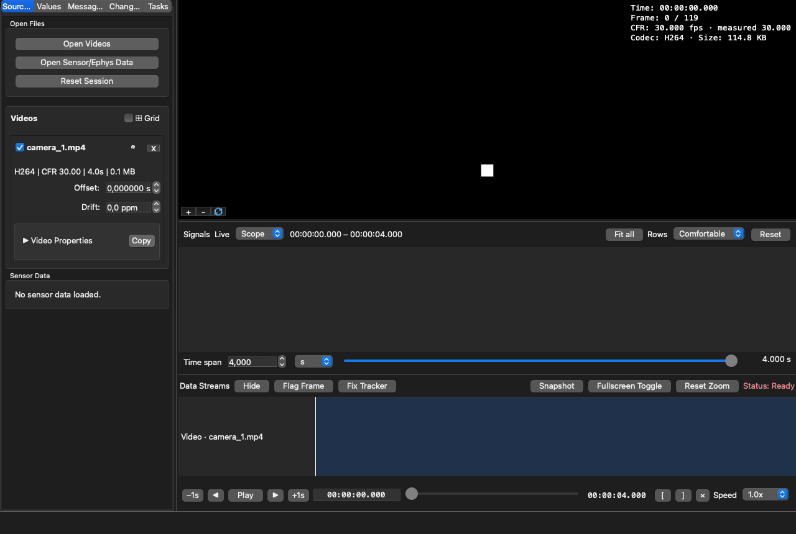
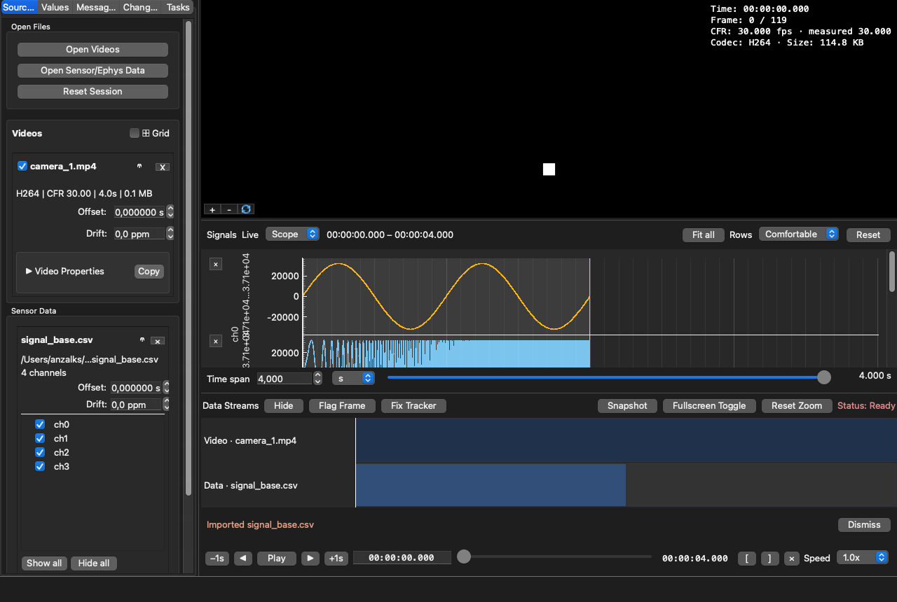

# Tutorial: inspect a first session

This example uses one camera and one sensor file. The same steps work with several cameras and many
recordings.

## 1. Load the camera

Drag the video into the window. Its name appears in the left panel and its image appears in the video
area. The readout over the video shows its time, timestamp-derived CFR/VFR rate, nominal rate, codec,
and file size. Open **Video Properties** for resolution, duration, and the complete timing evidence.

## 2. Load the recording

Drag the sensor or tracking file into the same window. Follow the importer if it asks which column
contains time or which units apply. The traces appear below the video.

## 3. Find an event

Drag the shared time bar until you see a meaningful event. Watch the video, traces, and values in the
left panel together. Use plot zoom when you need a smaller time range.
Drag the **Window** slider below the traces to choose that range. All traces keep the same fixed
window: they sweep from left to right together and restart at the left edge together.

## 4. Mark it

Select **Flag Frame** to create an annotation at the current time. The annotation table records it,
and you can later export the list for analysis or notes.

## 5. Save an observation

Use **Snapshot** to save the visible video and plots, or use the A/B controls to select a time range
for export. Your source files remain unchanged.
