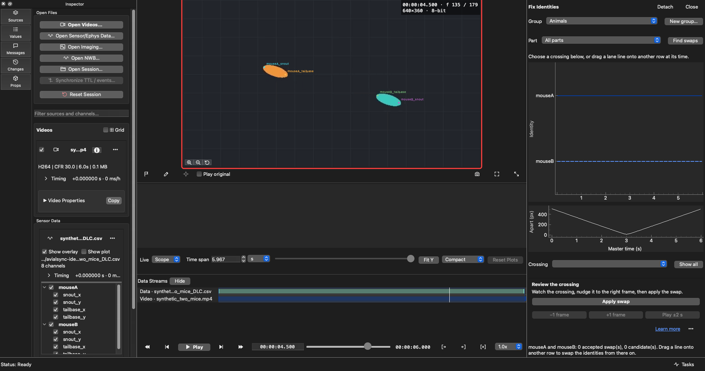
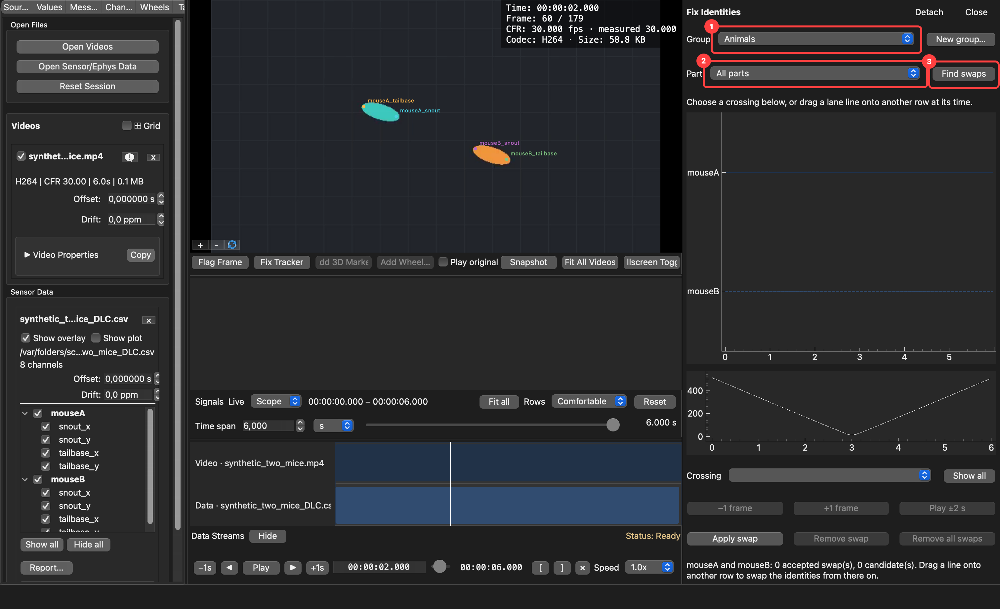
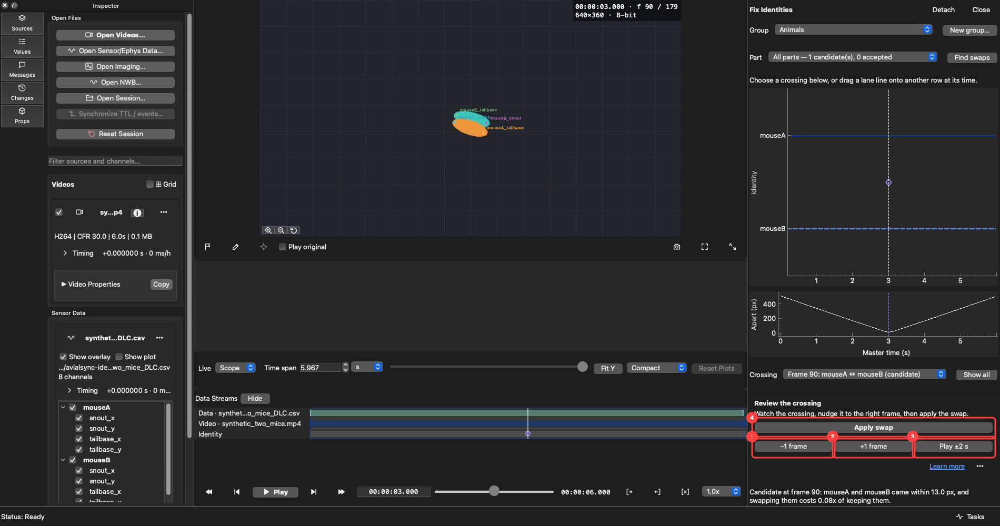
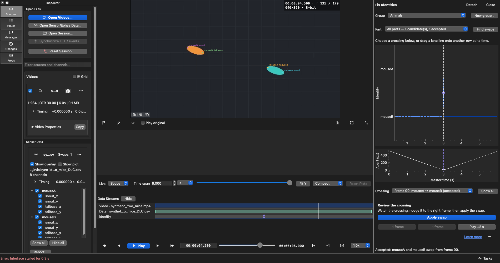
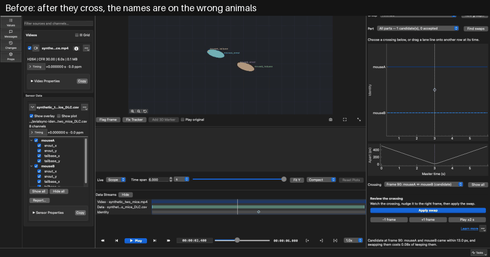
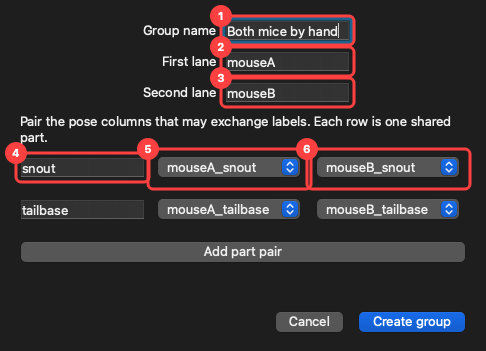

# Tutorial: fix switched identities

A pose tracker can lose track of *who is who*. Two animals pass each other and, from that frame on,
the file files each one's points under the other's name. Nothing looks wrong in a plot of one
column — it is a clean line that has quietly changed animal. This tutorial finds that moment, shows
you the evidence, and puts the identities back without touching your original file.

```{note}
Every image on this page comes from **generated demonstration data**: two drawn animals crossing
paths, and a pose file that is their true positions with the two identities exchanged at frame 90,
on purpose, so the right answer is known. Nothing here is a real recording. The files are named
`synthetic_two_mice.*` for that reason, and `tools/generate_identity_screenshots.py` rebuilds every
image from a clean clone. In the images `mouseA` is the teal animal and `mouseB` is the orange one.
```

## Two tools, two kinds of mistake

| The tracker got… | Use | What it changes |
|---|---|---|
| one point in one frame in the wrong place (an occluded nose lands on the wall) | **Fix Tracker** | that coordinate, in that frame |
| a *label* wrong (the two animals, or left and right wrists, exchanged) | **Fix Identities** | which column every frame from that point on is read from |

They share one edit history, one undo, and one export, so you can use both on the same file.

## Before you start

**Edit → Fix Identities…** is greyed out until a 2D tracking file is imported over a video. Hover it
and the tooltip says what is missing. A multi-animal DeepLabCut file, which names its animals in an
`individuals` row, works immediately. A single-animal file with `left_…` and `right_…` parts also
works. Anything else needs a group you declare yourself; see [Declare a group of your
own](#declare-a-group-of-your-own).

## 1. See the problem

Turn on **View → Overlays → Body-part names**. Each marker now carries its label. After the animals
cross, the names are on the wrong bodies:



The orange animal is `mouseB`, but its markers say `mouseA`. Watching for this is how most switches
are noticed, and you can fix one you spotted this way without running any detection (step 4).

## 2. Open the panel



Choose **Edit → Fix Identities…**. The panel docks to the right of the video and works on the
tracking file overlaid on the selected camera, so choosing a camera chooses the file.

1. **Group** is what could be confused: **Animals** (two or more individuals in one file),
   **Left / Right** (with the animal's name when there are several), or a group you declared with
   **New group…**.
2. **Part** is which point to judge the identities on. **All parts** reads each lane's centroid,
   which is the right choice for a whole-animal switch, because every part flips at once. The counts
   beside each entry — for example *1 candidate(s), 0 accepted* — tell you where there is something
   to look at before you click.
3. **Find swaps** scans the chosen group and part and proposes crossings. It works in the background
   and never changes your data; proposals only appear in the panel and on the Data Streams **Identity**
   lane.

A group of three or more animals also shows a **Compare** selector. It picks *which two* identities
the braid draws and a swap exchanges. AvialSync does not guess a pair for you.

**Detach** turns the panel into its own window, useful on a second screen, and becomes **Attach** to
dock it back. **Close** hides it; reopen it from the Edit menu. Closing drops unaccepted proposals
and any scan still running. Accepted swaps stay.

## 3. Review a crossing


1. **The braid.** One horizontal lane per identity. A proposal is an open diamond where the two lanes
   cross. Click anywhere on it to seek the video there.
2. **The separation trace** (*Apart (px)*) shows how close the two animals actually got. Proposals are
   only made where this dips: two animals that never come near each other are not confused for each
   other. The minimum here is at 3 s, the same instant as the diamond above it.
3. **Crossing** lists every proposal and every accepted swap, for example *Frame 90: mouseA ↔ mouseB
   (candidate)*. Choosing one seeks the main video to it. **Show all** returns the braid to the whole
   recording.

The line of text under the buttons is the evidence for the selected proposal, for example *came within
13.0 px, and swapping them costs 0.08x of keeping them.* Each animal's motion is carried forward to
this frame and compared with where each label was actually observed. **Costs 0.08x** means the
observations fit the *other* label's motion, leaving 8 % of the prediction error that keeping the
labels leaves. AvialSync only proposes a swap at half or less. If the points were missing across the
crossing, the text also says how many frames had no position. That is a reason to look more carefully,
not less.



1. **−1 frame** and 2. **+1 frame** move a *proposed* swap one frame earlier or later without applying
   it, for when the detector was a frame or two off. They are disabled for a swap you already
   accepted.
3. **Play ±2 s** loops the two seconds either side of the crossing in the main video, using the same
   A/B loop as the transport bar. It needs a video loaded.
4. **Apply swap** accepts it, described next.

## 4. Apply the swap

**Apply swap** (`Ctrl+Shift+S`) says: *from the frame on screen, these two identities are
exchanged.* Choosing a crossing seeks the video to it, so "apply the selected crossing" and "apply
where the video is" are the same frame. When nothing was proposed — you saw the flip yourself — park
the video on the first wrong frame and press it. It also works while playing, because that is when a
flip is noticed.

You can also drag the lane line in the braid onto the other lane's row at the time of the crossing.
The drag snaps to the nearby evidence, so the frame is the evidence's rather than the pointer's.



The loop below is the whole fix in one place: the same eight frames around the crossing, first as the
tracker filed them and then after **Apply swap**.



The same frame that was wrong in step 1 now reads correctly: the orange animal is `mouseB`. You are
told which two identities were exchanged and from which frame, and the outcome shows up in four
places:

- the diamond in the braid fills in and the lanes cross;
- the crossing is listed as *(accepted)*;
- the tracking file's card in the left panel shows **Swaps: 1**;
- the Data Streams **Identity** lane and the **Changes** tab list it.

Every consumer reads the corrected data, not just the overlay: the 3D view, plot rows, and the
readout agree with what you see.

## 5. Undo, remove, compare

- **Remove swap** reverses the accepted swap in force *at the playhead*. It never reaches into a part
  of the recording you are not looking at. If none is in force there, it tells you so instead of
  guessing.
- **Remove all swaps (N)** puts every identity in this file back to what the model predicted, in one
  undoable step. The button carries the count because it clears the whole file, not only the group and
  part on screen.
- **Edit → Undo** (`Ctrl+Z`) reverses the last swap. Dragging an accepted crossing back off its
  lane does the same.
- **Play original** (**View → Play original**, also a checkbox under the video) temporarily draws
  what the model predicted so you can compare. Turn it off to return to your edited view. The choice
  is saved with the session.

## Declare a group of your own

Names alone cannot say that a tracker confuses a wrist with an ankle, or two unrelated labels. When a
recording has no group to offer, the panel says so and **New group…** is the way in. The person who
knows the recording says which points swap:



1. **Group name** — anything unique. It is what appears in the **Group** selector.
2. **First lane** and 3. **Second lane** — the two identities, as they will be drawn in the braid.
4. **Part name** — one shared part, such as *snout*. Each row is one part that both lanes have.
5. **First lane pose point** and 6. **Second lane pose point** — the actual pose columns that belong
   to that part in each lane.
   **Add part pair** adds another row, so a group can span several body parts.

**Create group** validates the form and tells you what is wrong: the group name must be unique, the
two lane names must differ, names cannot contain commas or `|`, and each part needs a unique name and
two different pose points not already used in another row. The group is recorded as an undoable edit
and saved with the swaps.

## Fixing a single point instead

When it is the *position* that is wrong and not the label, use **Fix Tracker** under the videos (or
**Edit → Fix Tracker**, `Ctrl+Shift+T`).


While the mode is on, playback stops so the frame stays still, and every video view accepts
corrections. Drag a marker to where the body part is. The correction applies to that one point in
that one frame, is drawn with a dotted ring, and is undoable one drag at a time. The full description
is in the [User Guide](../user-guide/index.md#correcting-a-tracked-point).

## Where your work is kept, and how to use it

Accepted swaps are saved beside the pose file as `pose_csv_avialswap.csv` (for a `pose.csv`), as soon as you accept
them — there is no save step. Your original pose file and its imported cache are never modified;
deleting the swap file restores exactly what the model predicted.

Use **File → Export Changes…** (or **Export…** in the Changes tab) to write an edited copy of the
pose file with your swaps and corrections applied. A swap-only source is offered too. See
[Flag frames and export](annotating-and-exporting.md).
