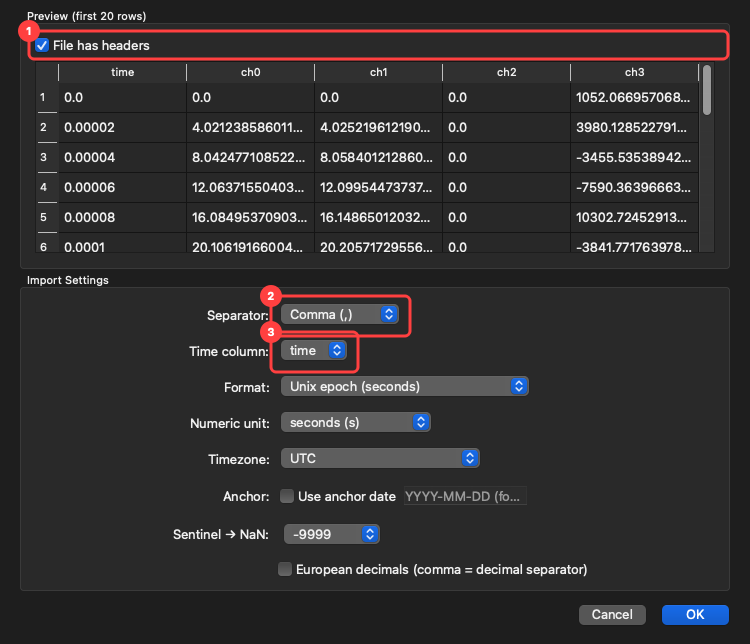
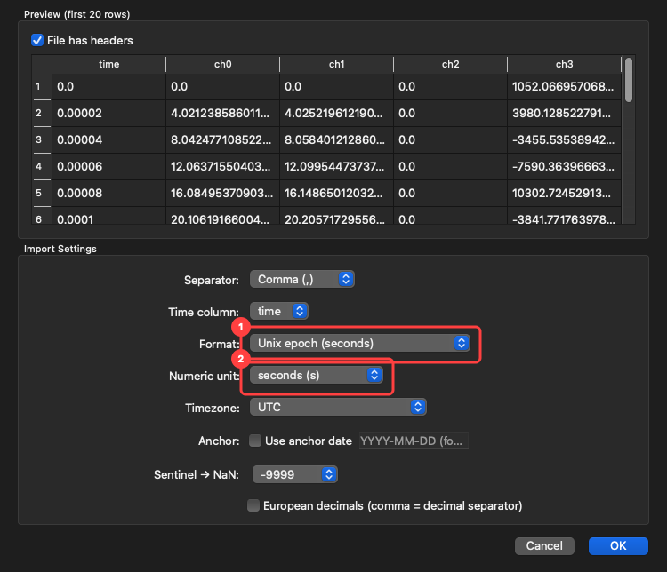
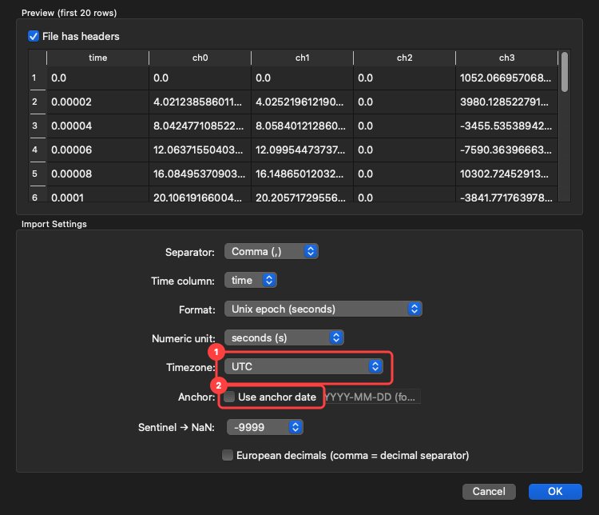
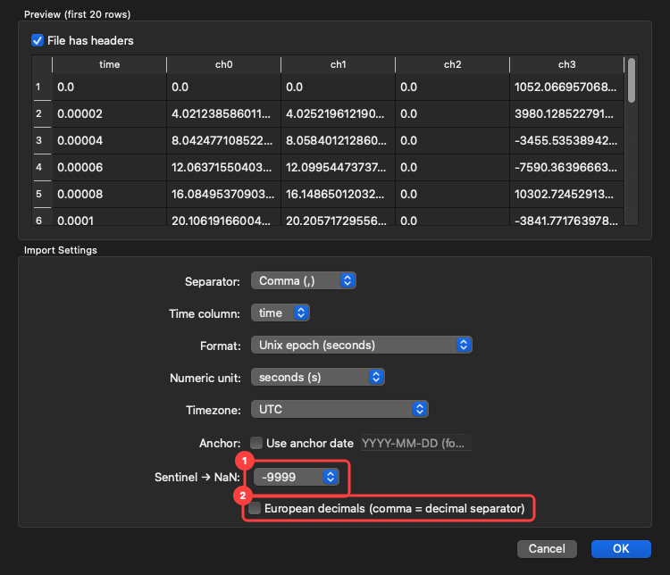

# Tutorial: import sensor and recording data

Video mostly describes itself. A table does not — a column of numbers could be seconds since the
recording started, milliseconds since midnight, or a Unix epoch in microseconds, and nothing in the
file says which. Guessing wrong shifts your data by hours without any visible sign that it happened.

The import wizard exists to make you state it. It shows the first twenty rows as it will read them,
so you can see the parse before anything is cached.

## Structure: how to split the file

1. **File has headers** — tick when the first row is column names, not data. The preview
   updates immediately, which is the quickest way to check you got it right.
2. **Separator** — comma, semicolon, tab, space, or pipe. A guess is made from the file and shown
   selected; change it if the preview columns look wrong.
3. **Time column** — which column carries the timestamps. Everything else becomes a data channel.

## Time: what the numbers mean

1. **Format** — how to read the timestamp text. **Auto-detect** handles most files. The list covers
   ISO 8601 (with and without milliseconds), date-and-time in US and European order, time-only, and
   Unix epoch in seconds, milliseconds, or microseconds. There is also a custom field for a
   `strftime` pattern of your own.
2. **Numeric unit** — only meaningful when the column is a plain number rather than a date:
   seconds, milliseconds, microseconds, or nanoseconds.

This pair is where a silent hours-long error comes from. If the preview's first and last times do
not look like the duration you recorded, the unit is wrong.

## Timezone: state it, never assume it

1. **Timezone** — UTC, local system time, or a named zone. **You must choose.** A timezone-naive
   timestamp silently treated as UTC is the cause of real 1–2 hour "data corruption" reports in
   comparable tools, so AvialSync makes it an explicit decision rather than a default.
2. **Use anchor date** — for time-only columns (`10:30:00.000`) that carry no date at all. Supply
   the recording's date so the times land on the right day.

## Missing values and decimal commas

1. **Sentinel → NaN** — the value your logger writes to mean "no reading": `-9999`, `NaN`, `NA`,
   `#N/A`, or one you type. It becomes NaN, which plots as a break in the trace instead of a real
   measurement. Nothing is converted unless you ask: AvialSync will not invent data the
   logger did not record, and will not silently turn a real `-9999` into a gap.
2. **European decimals** — tick when the file writes `1,5` for one-and-a-half. This also changes
   how the separator is read, so check the preview after toggling it.

## What happens after you accept

The file is parsed once and cached beside it in a `.avialcache/` directory: raw arrays plus the
decimation pyramid that keeps plotting responsive at 50 kHz. Later opens memory-map that cache
instead of re-parsing, so the second load of a large file is quick.

The cache key includes a content hash, not just the path and modification time. Editing the file in
Excel, or copying it across drives, invalidates the cache and triggers a rebuild — a stale cache in
a measurement tool is a trust problem, not a performance one.

## Importing several files at once

Dropping a folder, or several files together, opens a batch import. Each row is one file with the
loader AvialSync picked for it; confirm or change the choice, then import them in one pass rather
than answering the same wizard repeatedly.

If a session folder is recognised by a [session plugin](../plugin-guide.md), it is laid out
automatically instead — including the shared time base — and you are not asked at all.
