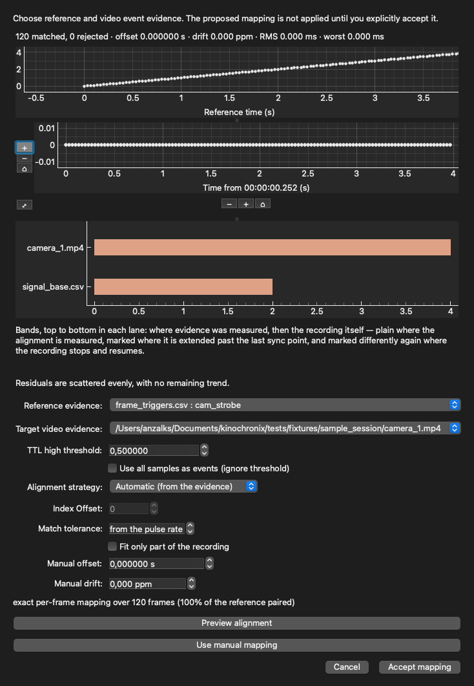

# Tutorial: align recordings

*The import wizard shows how a timestamp column parses before anything is cached.*

## Choose a reference

Find an event visible in more than one recording: a flash, movement, pulse, or camera frame trigger.
The shared time bar is the reference for what you are comparing.

## Start simple

If one recording is simply early or late, adjust its offset in the left panel while watching the
event. This changes how AvialSync views the recording; it never rewrites the original file.

## Use TTL or event evidence

When recordings include repeated pulses or camera-frame events, open the synchronization wizard.
Choose the evidence sources, inspect the proposed matches and timing error, then explicitly accept or
reject the mapping. Accepted mappings are saved with the session so another person can review them.
With **Exact Index (1:1 Frame Mapping)** accepted, exact scrubbing, pause, and frame stepping use the
accepted frame-trigger timestamps. All videos seek from the same master trigger while retaining
their own original presentation timestamps.

## Check the result

Move to several events across the recording, not only the one used to align it. Look for drift at the
beginning and end. The **Data Streams** view shows availability; the video and trace panes show the
actual aligned content.
