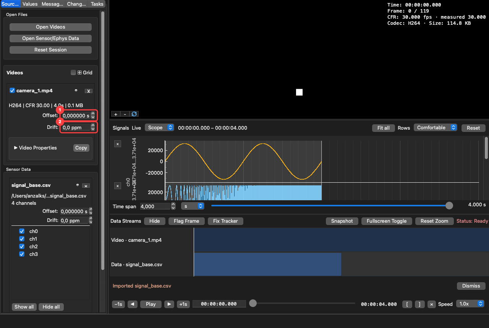
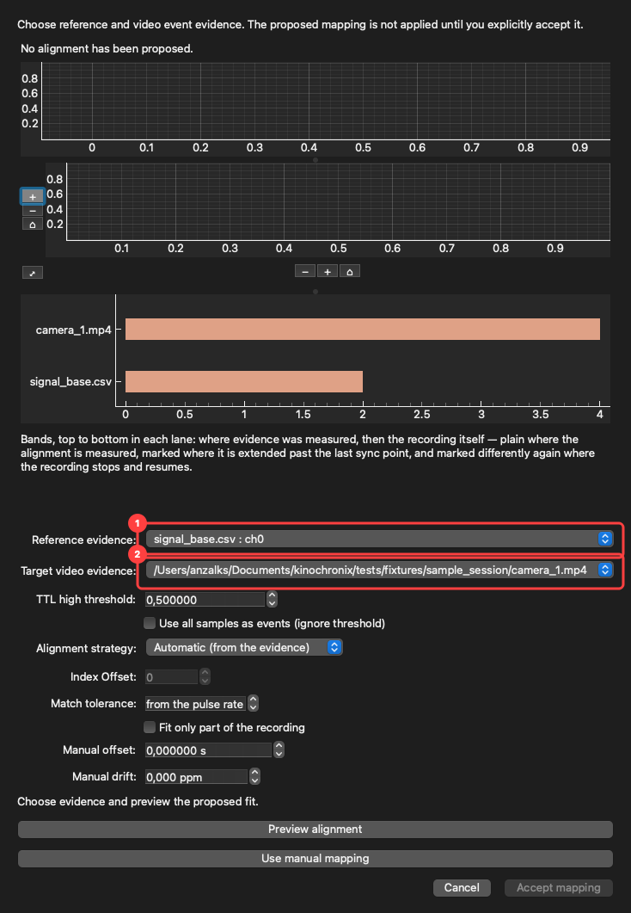
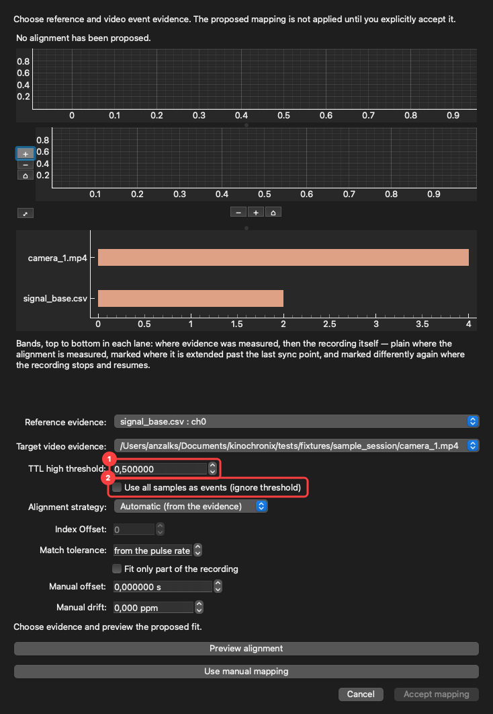
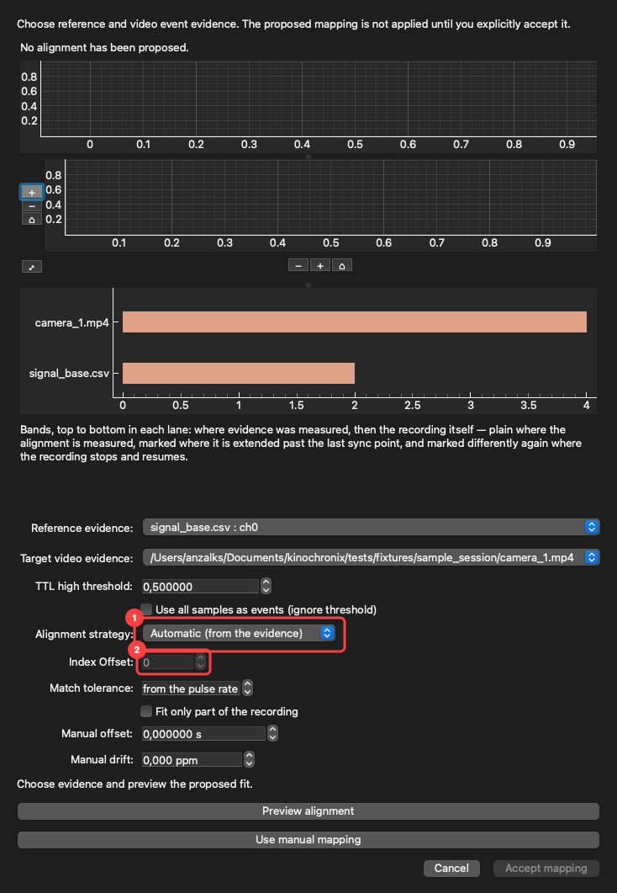
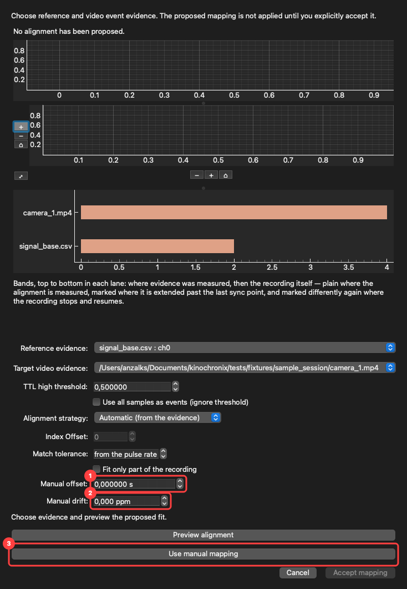
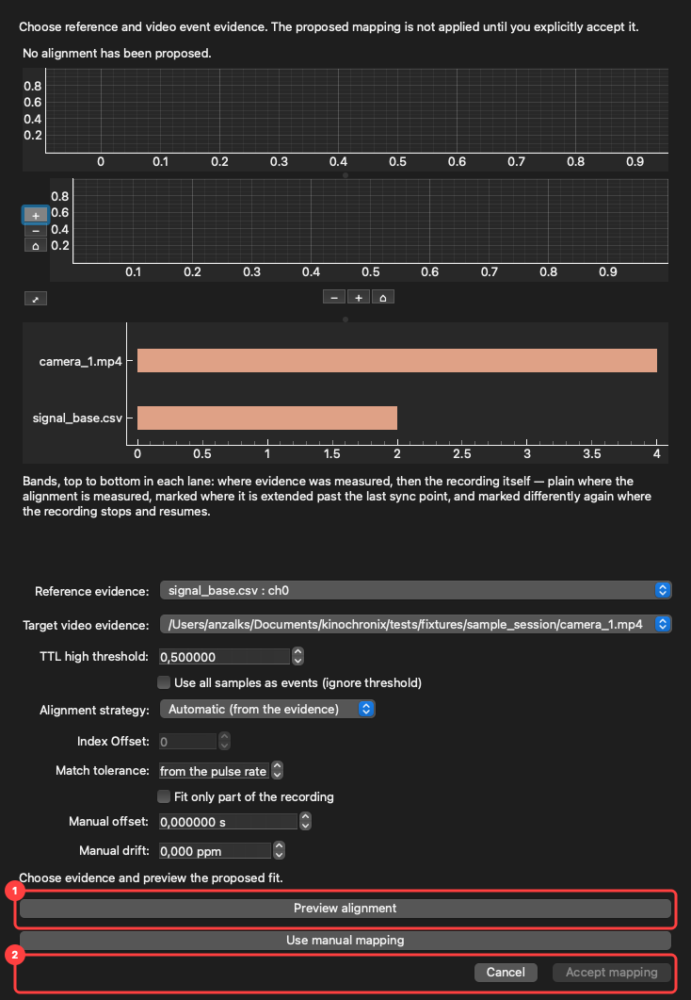

# Tutorial: align recordings

Recordings that came off independently-clocked hardware rarely agree. This walks through the three
ways AvialSync fixes that, in the order you should try them: a manual offset, a drift correction,
and evidence-based alignment from TTL pulses or camera frame triggers.

**Nothing here rewrites your files.** An alignment changes how AvialSync *reads* a recording onto
the shared timeline. The original stays byte-for-byte as the acquisition system wrote it.

## Before you start

Find an event visible in more than one recording: a flash, a movement, a pulse, a camera frame
trigger. That shared event is what you will judge alignment against.

Load your files first; [the first-session tutorial](first-session.md) covers that.

## 1. A fixed offset, when one recording is simply early or late

Every source carries its own **Offset** and **Drift** in the left panel.

1. **Offset** shifts the whole recording along the shared timeline, in seconds. Positive moves it
   later. Use this when a camera started before or after the others.
2. **Drift** corrects a clock that runs fast or slow, in parts per million. Use it when the
   recordings agree at the start and separate towards the end — a fixed offset cannot fix that,
   because the error grows with time.

Scrub to your shared event, adjust **Offset** until the views agree, then check a second event near
the *end* of the recording. If the two events need different offsets, the clocks are drifting and
you want **Drift** as well, or better still the evidence-based route below, which measures both.

## 2. Evidence-based alignment from TTL or frame triggers

When a recording carries repeated pulses — a TTL line, a camera exposure trigger, a frame-timestamp
log — AvialSync can fit the alignment from that evidence instead of you eyeballing it. Open
**Synchronize…** from the toolbar or menu.

### Choose what to compare

1. **Reference evidence** — the source you trust. Usually the acquisition system's TTL channel or a
   trigger log.
2. **Target video evidence** — the recording being aligned *to* that reference.

### Tell it how to read the reference

1. **TTL high threshold** — the voltage above which a sample counts as a logical high. Set it
   between your line's low and high levels. This is how a continuous analogue trace becomes a list
   of pulse edges.
2. **Use all samples as events** — check this when your reference is *already* a list of event
   times, such as a CSV of frame triggers, rather than a voltage to be thresholded. It disables the
   threshold, because there is nothing to threshold.

Getting this wrong is the most common cause of a poor fit: a threshold outside the signal's range
finds either no edges or every sample.

### Choose the strategy

1. **Alignment Strategy**
   - **Affine Fit (Drift Compensation)** — fits an offset *and* a drift rate across all matched
     events. Use this for two independent clocks. It is the right default.
   - **Exact Index (1:1 Frame Mapping)** — maps video frame *n* to reference event *n* directly.
     Use this when the reference genuinely triggered each exposure, so the correspondence is exact
     rather than fitted. This is the strongest alignment available and survives dropped frames,
     which an offset-and-drift pair cannot express.
2. **Index Offset** — enabled only for Exact Index. Sets which reference event video frame 0
   corresponds to. Leave it at 0 unless recording started mid-sequence.

### Or set the mapping by hand

If you already know the numbers — from the rig's documentation, or a previous session — enter them
directly instead of fitting.

1. **Manual offset**, in seconds.
2. **Manual drift**, in parts per million.
3. **Use manual mapping** applies them as a proposal, which you still accept explicitly.

### Preview first, then accept

1. **Preview alignment** extracts the evidence, matches events, and fits the mapping. The summary
   line reports how many events matched, the fitted offset and drift, and the residual timing error.
   **Read that before accepting.** A fit from three matched events out of nine hundred is telling
   you the threshold or the strategy is wrong.
2. **Accept mapping** applies it. Until you press this, nothing has changed. A proposal is never
   applied silently, and it never becomes your data on its own.

Accepted mappings are saved with the session, so a colleague can see what was applied and on what
evidence.

## 3. Check the result

Alignment that looks right at the event you used to align it proves very little.

- Move to several events **across the whole recording**, especially near the beginning and end.
  Drift shows up at the edges.
- **Data Streams** shows when each source has data; the video and plot panes show the aligned
  content itself.
- With **Exact Index** accepted, scrubbing, pausing, and frame-stepping all land on the accepted
  trigger timestamps, and every video seeks from the same master trigger while keeping its own
  original presentation timestamps.

If a camera has no coverage at the selected time it shows **No Footage** instead of a stale frame.
That is correct behaviour, not a fault.
