# User Guide

## Main areas of the window

- **Videos** show each available camera at the selected experiment time. The block under each video
  time shows timestamp-derived CFR/VFR rates, the nominal container rate when it differs, codec, and
  file size.
- **3D Tracking** shows complete XYZ tracking points beside the videos at the same experiment time.
  Drag the vertical splitter handle to give either view more space.
- **Plots** show sensor, electrode, and tracking values in a fixed oscilloscope-style time window.
  The trace grows from left to right and starts again at the left edge when the window completes.
  Set **Time span** in `ms`, `s`, `min`, or `h`, then use the single slider to choose the shared
  visible span. A smaller limit gives fine adjustment; a larger unit gives coarse adjustment.
  Left-click a trace to move the shared playhead to that exact time across every view.
- **Data Streams** shows when every loaded file is available. A coloured span means the source has
  data; an empty span means it does not.
- **Shared time bar** moves every view together.
- **Left panel** has a page rail with **Sources** (files, visibility, offsets, properties),
  **Values**, **Messages** (prose the recording itself carries), **Changes** (everything you
  flagged, labelled, or corrected), and **Props** (physical apparatus). Every page name is shown
  in full; on a short window the rail scrolls. Up and Down move between pages, and
  **View → Inspector** or the command palette opens any of them. The last page used is restored
  next time.
- **Tasks** opens from the status bar and lists what is loading, with a cancel where the work
  supports one.
- An empty page says what will fill it: **Values**, **Messages**, **Changes**, **Props** and
  **Tasks** each name what appears there and, where one menu command fills it, offer that command.
  Guided panels (wheel and prop placement, identity review, alignment) show one step at a time:
  one sentence, a bold next action, rarer and destructive choices in **⋯**, detail behind
  **More…**, and **Learn more** linking to this guide.

  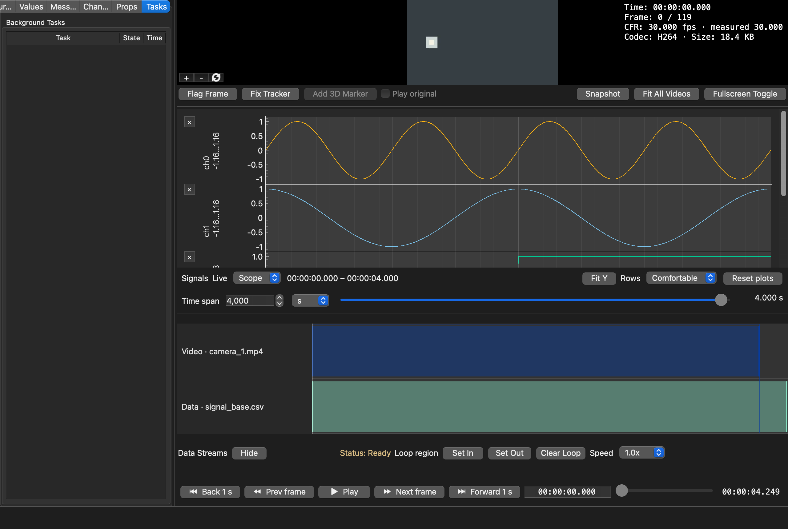
- **Tasks lists everything the application is doing** — imports, session saves and loads, proxy
  builds, every export, and the metadata probe each video runs when it opens. A job that has gone
  quiet for longer than it should is marked *not responding* rather than left looking busy, which
  is the difference between slow and stuck.
- **The line at the bottom of the window** is where results appear: a finished export, a generated
  proxy, a file that could not be read. Successes clear themselves; anything you need to act on
  stays until you dismiss it. If more than one arrives at once, a count beside the message says how
  many are waiting and Dismiss brings up the next, so nothing is lost by being second. Successes do
  not queue: importing three files leaves one line, not three to clear. Failures keep their
  technical detail behind **Show details**.
- **Unsaved work from a previous run** is kept in a recovery snapshot and loaded by
  **File → Recover Unsaved Work…**. Being told about it at launch instead is a preference
  (**Preferences → Storage → Offer unsaved work at launch**, off by default): with it on, **Restore**
  opens the work and **Dismiss** hides that version on later launches while keeping its safety copy.
- **A command that cannot run yet is greyed out, with the reason in its tooltip.** Nothing accepts
  a click and then tells you it could not act on it.

## Where the detail lives

- Importing tables — separator, time format and unit, timezone, sentinels:
  [Tutorial: import sensor and recording data](../tutorials/importing-data.md)
- Aligning recordings: [Tutorial: align recordings](../tutorials/synchronization.md)
- Flagging frames and exporting: [Tutorial: flag frames and export](../tutorials/annotating-and-exporting.md)
- Fixing a tracker that swapped animals or left/right points, step by step:
  [Tutorial: fix switched identities](../tutorials/fixing-identities.md)
- Sessions, proxies, the 3D view, plot navigation, shortcuts:
  [Sessions, proxies, and the 3D view](sessions-and-media.md)

## Aligning recordings

Three routes, in the order to try them — all covered field by field, with annotated screenshots, in
[Tutorial: align recordings](../tutorials/synchronization.md):

- **Offset** (left panel, per source) shifts a recording along the shared timeline in seconds.
  **Align → Nudge selected source earlier / later** (`Ctrl+Shift+Left` / `Right`) does the same by
  one step without leaving the keyboard, on whichever source is selected.
- **Drift** (left panel, per source) corrects a clock running fast or slow, in ppm. Reach for it
  when recordings agree at the start and separate by the end — a fixed offset cannot express that.
- **Align → Synchronize TTL / events…** fits the mapping from TTL pulses or frame triggers. Choose reference and target
  evidence, set the **TTL high threshold** (or tick **Use all samples as events** when the reference
  is already a list of event times), then leave **Alignment strategy** (under **More…**) on **Automatic** unless you
  have a specific reason to override what the evidence supports. **Exact index** is valid only when
  each recorded frame has a corresponding event, not merely when an exposure was requested. Choose
  **Preview alignment**, inspect the matches and residuals, then **Accept mapping**. Nothing is
  applied until you accept it.

## Messages the recording carries

Many acquisition systems store prose alongside the samples — a note typed while the animal was
running, a line the software wrote when the session started. The **Messages** tab lists whatever
the loaded files carry, placed on the shared timeline, and the shared time bar shows them as their
own lane.

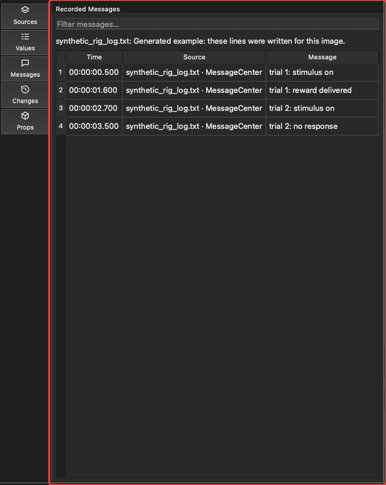

*The messages in this image are generated for it — the source is called `synthetic_rig_log.txt` — not read from a recording. The untimed note sits above the table, as described below; the four timed rows are placed on the clock.*

- **Messages are read-only.** They belong to the file and cannot be written back to it, so no cell
  in this tab can be edited. This is the difference from what the **Changes** tab holds, which is
  yours: authored, editable, and exported as your own work. The two never mix, so an exported
  annotation always says a person wrote it.
- **Selecting a row seeks the timeline** to that moment, the same as clicking a plot.
- **The filter box** narrows the list by message text, source, or stream name.
- **Notes with no time appear above the table**, not in it. A file header or a comment appended
  after the recording stopped has no place on the clock, and pinning it to the start would make it
  read as a description of the first sample.
- **Correcting a source's offset moves its messages with its samples**, because a note and the
  trace it describes are evidence from the same clock.

If the tab is empty, the loaded files carry no prose — or they were imported before AvialSync read
it, in which case re-importing once picks it up. See
[Troubleshooting](../troubleshooting.md#the-messages-tab-is-empty).

## Flagging and exporting

Covered in [Tutorial: flag frames and export](../tutorials/annotating-and-exporting.md).

- **Flag Frame** (`M`) records the current time *and*, for every loaded camera, that camera's exact
  frame index and presentation timestamp — which is what makes the export usable as a pose-model
  corrections list.
- Right-click a plot to add a marker at that moment without moving the playhead first.
- The **Changes** tab lists what you flagged; double-click a label to name it.
- **File → Export Changes…** writes your annotations, and any corrected pose data, out.
- **File → Export Snapshot / Trimmed Video Clip / Data Slice** cover images, media, and signals.
- **File → Export Stimulus Grid…** makes a camera-row, event-column MP4 with the selected TTL or stimulus
  trace across the bottom. Choose the output frame rate and playback speed to slow high-speed
  footage. See the [illustrated export walkthrough](../tutorials/annotating-and-exporting.md#export-an-event-aligned-video-grid-with-its-ttl-trace).
  Clips are copied rather than re-encoded, so they keep the original pixels.

## Useful controls

Controls sit with what they act on. Under the videos: **Flag Frame**, **Fix Tracker**, **Add 3D
Marker**, **Play original**, **Snapshot**, **Fit All Videos** and **Fullscreen** (the last three as glyph buttons; hover
for the name and shortcut). One row
under the plots holds **Live**, **Time span** and its slider, **Fit Y**, row density (Compact,
Comfortable or Large), and **Reset Plots**. Data Streams has a **Hide** control above its lanes.
Its lane labels shorten when space is tight; hover to read the full name. Compact density shows
up to ten lanes at once, then scrolls vertically. **Preferences → Appearance** sets the Data
Streams density and the visible-row limit for each density.
Numbers use a full stop as the decimal separator everywhere, whatever your system's region
settings, and spin boxes accept it the same way; imported files are still read in their own
format.
The playback row holds back/forward jumps, frame steps, **Play**, editable time, the scrubber,
end time, loop controls and playback rate. The status bar reports activity and short status
messages. Hover over a glyph button to read its action name. Physical props are managed in the
**Props** tab; see [Physical props](#physical-props).

Before anything is open, the drop area takes almost the whole window and the empty plot and Data
Streams areas stay small. The layout you had comes back when the first recording opens.

- **Flag Frame** creates an annotation at the current time. It appears in the **Changes** tab
  alongside any tracking corrections you have made.
- **Snapshot** writes a figure of the current moment for notes or reports: every displayed camera
  at the resolution it decoded at, the 3D pose, and the whole channel stack including rows you
  would have to scroll to see. It is composed rather than captured, so nothing is cut off at the
  edge of a pane and each camera is captioned with its own frame number, timecode, and format.
- **Fullscreen** expands the selected video view.
- Each camera shows its name and a one-line timecode (time and frame number) at the top of the
  picture; a long name shortens first. **Preferences → Overlays → Video timecode detail** switches
  to the full block with rate, codec and size, and **View → Overlays** hides either. One or two
  cameras are sized to their picture's shape instead of sitting in a black field.
- **Fit All Videos** (**View → Fit All Videos**, `Ctrl+Shift+0`) sets every camera back to its
  whole frame: zoom 1.00×, no pan. Each camera's own reset button does the same for one camera.
  **Fit Y** under the plots is different: it fits the plots' vertical range.
- Set **Time span** and choose `ms`, `s`, `min`, or `h`, then drag the slider in the same row. The
  slider is linear within that limit and controls every row; rows do not have separate
  scroll or zoom controls. The number updates immediately, plot refreshes are capped at the display
  cadence while dragging, and the final value renders on release, so rapid adjustment does not
  queue redraws.
- Select the small **×** beside a plot to hide it. This unchecks the same channel in the left panel.
- Unchecking a video or plot keeps it loaded but hidden through window resizing, grid changes, and
  fullscreen toggles. Hidden videos are paused until shown again, then resynchronize automatically.
- **Reset Plots** under the plots (also **View → Reset Plots**, `Ctrl+0`) expands the shared plot
  window to the full loaded timeline and refits every visible plot.
- The row density selector sets the height of every plot row at once: Compact, Comfortable, or Large.
- The playback row's loop buttons mark an A/B range for inspection or export: **Set In** (`[` or `I`)
  and **Set Out** (`]` or `O`) at the playhead; **Clear Loop** removes it. The rate selector sets
  playback speed. The scrubber shows loaded coverage, annotation ticks and the active loop span.
- After accepting exact frame-trigger alignment, exact scrubs, pause, and frame-step land on those
  trigger timestamps for every synchronized video.

Use tooltips by resting the pointer over any button if you are unsure what it does.

When AvialSync finds a data-quality or alignment issue for a loaded source, its card shows a
native status icon beside the source name. Hover it for a summary and select it for the file's
properties and full issue details. A source with no accepted alignment carries one, for example:
it says the source sits on the master clock by its own timestamps alone, which is right when the
hardware shared a clock and a guess when it did not. A tracker card can also show **Swaps: N**, the
number of accepted identity corrections.

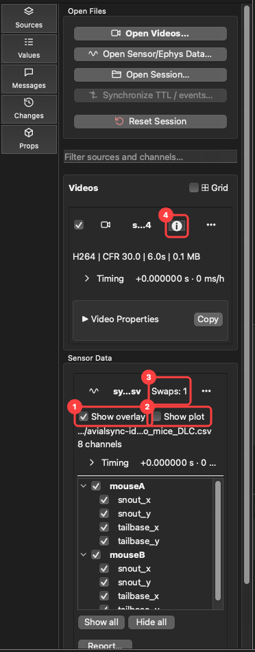

1. **Show overlay** draws the tracker on its camera. 2. **Show plot** adds its coordinate channels to
the plots. 3. **Swaps: N** is the accepted identity corrections. 4. The status icon on the video card
opens that source's details. The tracker's landmarks are listed under the header, grouped by animal
when the file names its individuals.

## Correcting a tracked point

Pose estimates are sometimes wrong: an occluded nose lands on the wall. Select **Fix Tracker** under the videos, or **Edit → Fix Tracker**
(`Ctrl+Shift+T`), to correct one by hand.

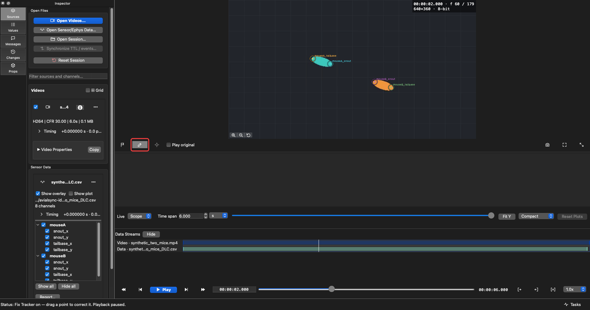

- Every video view accepts corrections while the mode is on, and playback stops so the frame you
  are aiming at stays still.
- Drag a marker to where the body part really is. The correction applies to that one frame of that
  one point; every other frame keeps the prediction it had.
- A corrected coordinate is drawn with a dotted ring, so a hand correction is never mistaken for
  model output. Turn the ring off under **View → Overlays → Hand-corrected marks** if you want to
  see the result plainly.
- **Edit → Undo** (`Ctrl+Z`) reverses corrections one drag at a time.
- Zooming with the wheel and panning with the middle mouse button keep working while the mode is on.

### Fixing switched identities

Use **Edit → Fix Identities…** when the tracker starts following the wrong animal or confuses two keypoints such as left and right wrists. The panel docks beside the video. Choose a **Group** (animals, left/right, or one you declare with **New group…**), then one body part or **All parts**, and press **Find swaps**. The braid shows where trajectories approach, and the separation trace below it shows why a crossing might be plausible. Proposals never change data. Choose one in **Crossing** to seek the video to it, nudge it with **−1 frame** / **+1 frame**, loop it with **Play ±2 s**, and accept it with **Apply swap** (`Ctrl+Shift+S`). **Remove swap** reverses the swap in force at the playhead, and **Remove all swaps** clears the file. The [tutorial](../tutorials/fixing-identities.md) walks through every control with images.

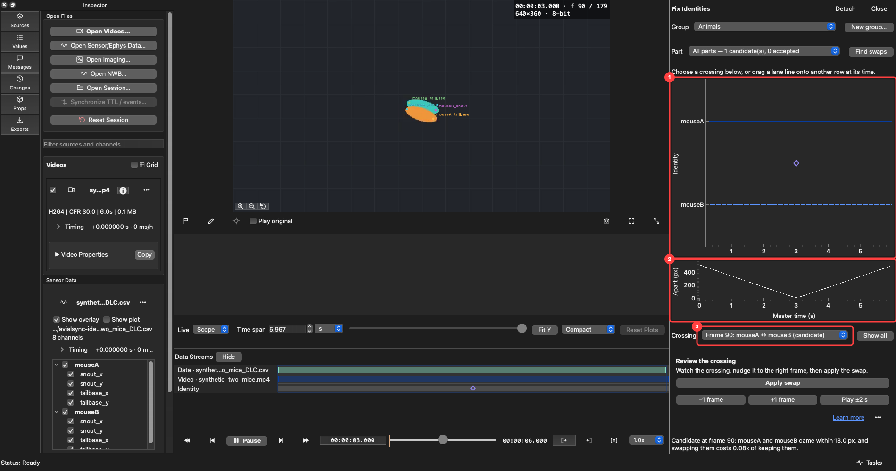

Drag a line after a crossing into the other lane to accept a swap from that frame onward. The drag snaps to the evidence node. Drag an accepted crossing back to remove that event, or use **Edit → Undo**. The viewer reads an edited cache generation after acceptance; the original pose file and imported cache stay untouched. **View → Play original** temporarily shows the model's imported prediction for comparison; turn it off to return to the edited view. This view choice is saved with the session. Accepted swaps also appear in the Data Streams identity lane and the Changes tab.

### Reviewing and exporting what you changed

The **Changes** tab lists everything you have done to the session in one place and in time order:
flagged frames, labelled ranges, corrected tracking points, and accepted identity swaps. Each row says when it happened,
which recording it belongs to, and what it was — a correction names the body part, the coordinate,
and the video frame.

- Select a row to go back to it. AvialSync seeks there, selects the camera it belongs to, and rings
  the corrected point for a few seconds so you can see which one is meant.
- Double-click an annotation's detail to rename it.
- **Delete** removes the selected annotation or identity swap, or restores a corrected point to what the model predicted. Each deletion is undoable with `Ctrl+Z`.

**Export…** in that tab, or **File → Export Changes…**, writes your work out. Only recordings with
something to export are listed, each with a destination already filled in beside the data it came
from, which you can edit or choose with **Browse**. Three things can be written:

- **Annotations** — one CSV row per flag and camera.
- **Edited pose data** — one full copy of the pose file with your corrections and accepted identity swaps applied, for analysis. It is offered even if a swap is the only edit. The scorer name is marked so the file never reads as raw model output, and a corrected
  point's likelihood is set to 1.0 so that code filtering on likelihood does not throw your
  correction away.
- **Retraining set (DeepLabCut)** — the corrected frames as `labeled-data`, with their images, ready
  to merge into a training set and retrain the network on its own mistakes. Every body part on a
  corrected frame is written, not just the one you moved, because a training label is a whole pose.
  Off by default: it decodes a video frame for each label.

Nothing is written until you choose it, and your original pose files are never modified.

### Where corrections are kept

Corrections are saved **next to the pose file**, in `pose_csv_avialfix.csv` (for a `pose.csv`), as soon as you make
them — there is no separate save step, and closing without saving the session does not lose them.
The file is an ordinary CSV of `frame,bodypart,x,y,shown_as` with a commented header, so you can read it in
pandas (`pd.read_csv(path, comment="#")`) or a spreadsheet and see exactly what was changed by hand.

Your pose data is never modified. The imported CSV and its cache are not written to, so deleting the
corrections file restores exactly what the model predicted. Because the corrections live with the
recording rather than with the session, opening the same pose file in a different session — or on a
colleague's machine, if they have the data folder — brings them along.

The session file records only how many corrections each source had. If that number and the
corrections file disagree, or the file has gone missing, AvialSync says so instead of quietly
showing fewer points. If the recording sits somewhere that cannot be written — an archived
acquisition on read-only media — the corrections are kept in the session instead and you are told
so; save the session to keep them.

Accepted corrections and identity swaps are built into derived cache channels so consumers of an edited pose source agree about what is shown. Accepted swaps are saved beside the pose file in `pose_csv_avialswap.csv` (for a `pose.csv`); the original CSV and its imported cache are not changed.

## 3D tracking controls

Tracking files use the existing import path. Every complete channel triplet named `point_x`,
`point_y`, and `point_z` becomes one point in the 3D pane; incomplete triplets remain ordinary
time-series plots. The 3D pane does not guess connections between points.

When importing a tracking file directly, choose **Use as → 3D pose** to load its XYZ points as
pose data, or choose **2D pose on [camera]** to draw XY points over that video. **Data channels**
keeps the file in the plots. Load the camera videos first if you want to choose a 2D overlay
target. A session plugin can make these choices for the recording; AOL supplies its own pose
roles and camera matches. Your choice is saved with the session and used when it reopens.

Routed tracking sources start with their visual overlay enabled, so all tracking data is visible
by default. In the source card, directly under the file header, **Show overlay** draws a 2D
tracker on its assigned camera or shows a 3D tracker in the 3D view; uncheck it to hide that
source. **Show plot** adds that source's coordinate channels to the plots and starts disabled.
Choose the coordinate channels you want in the source tree first: a landmark appears in the visual
overlay only when all of its required coordinates are checked. Checking or unchecking them creates
no plot rows until **Show plot** is enabled. The two presentation controls are undoable and saved
in the session.

- Drag with the left mouse button to orbit.
- Use the mouse wheel to zoom.
- Select **Fit View**, or double-click the view, to frame the current pose again.

On a narrow window, scroll the 3D controls sideways to reach the axis, bones, and Fit View controls.

## Placing a 3D marker

When you need a point the pose model was not trained on — a landmark on the rig, say — choose
**Edit → Add 3D Marker** (or the button beside Fix Tracker). Name the marker, then click it once in
each camera on the current frame. When every calibrated camera has a click, the marker is placed in
3D and drawn as a **hollow ring** in every camera and in the 3D view, so it is never mistaken for
the model's own points. Adding it is one undo step.

- With **Fix Tracker** on, drag a marker to move it; it is re-placed in 3D when you let go.
- With Fix Tracker off, right-click a marker and choose **Delete 3D marker**.
- A marker exists on the frame it was placed on.

Markers are saved beside the pose files they extend — `<Camera>_eks_custom_markers.csv` next to each
camera's 2D pose file (in `pose-3d/` for a camera without one) and `_eks_custom_markers.csv` next to
the 3D pose — and are read back when the session is opened again. The pose files themselves are never
written.

### The cameras' calibration

A 3D marker, a wheel, and reprojection all need the calibration anipose made for your rig. AvialSync
looks for `pose-3d/calibration_ref.txt` (a small file naming the `.toml` and the videos it covers),
then `calibration.toml` in `pose-3d/`, then in the session folder. If none is found when you place a
marker or a wheel, you choose:

- **Import…** — point at an existing `calibration.toml`. A `calibration_ref.txt` naming it is written
  in `pose-3d/`; copy that file to other experiments filmed with the same rig.
- **Compute** — fit one from this session's 3D pose and its 2D tracking. It projects correctly, but
  its lens numbers are not physical, so use it for projecting and placing points, not for camera
  geometry.

Nothing is overwritten: an existing `calibration_ref.txt` is kept under a dated name, and a fitted
calibration never takes the name of a file already there.

### Checking the 3D pose against the video

**View → Overlays → 3D reprojection** (also the button in the 3D pane's header) projects every 3D
point back into each camera as a **cross**, beside the 2D tracking's dot: the gap between the two is
the reconstruction's error on that body part. Switching it on without a calibration does not stop
you; a message offers **Choose Calibration…**.

## Physical props

The **Props** tab (also **Edit → Add Physical Prop…**) records the apparatus in the recording:
a **Horizontal ladder**, a **Wheel**, a **Belt**, or a **Ball**. Choose the kind at the top of the tab;
the controls below change with the kind. Ladder and wheel placement use camera clicks. For a belt or
ball, enter the fixed geometry first, then choose sensor readings or camera clicks for motion.
Each accepted edit is one undo step, and each prop is saved as
`pose-3d/<name>_prop.toml` in the recording folder. For ladder, belt and ball marks, solid squares
in the camera views are your clicks; dashed marks are 3D projections.

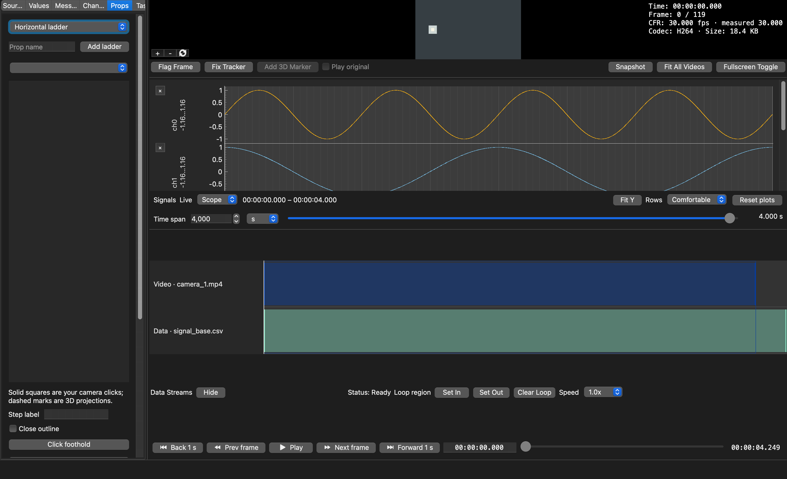

For a **ladder**, each step is clicked on its own: **Click foothold** records one point, **Click rung
ends** records the two ends of a rung, and **Close outline** joins the last point to the first for a
platform edge. Click the point in each camera where it is visible, use **Next point** for the next one,
then **Save step**. A point clicked in two calibrated cameras is placed in 3D and reports its fit
error; a point seen by one camera stays 2D and is still kept. Steps stay in the order you placed them —
**Move step up** / **Move step down** reorder them, and **Rename selected step**, **Re-click selected
step** and **Remove step** edit one; these are in the step panel's **⋯** menu, with the removals
last. The panel's bold button, **Save and click next step**, is the usual next action. AvialSync never forces rungs onto one level, so an irregular
ladder is recorded as it is. For a regular ladder, click the ends of two neighbouring rungs, set
**Rungs in total**, and choose **Extrapolate from first two rungs**. The remaining rungs are drawn
dashed, and the first and last estimates are labelled *(est.)*, with correct perspective in every camera where both rungs are visible;
one camera is enough, and calibration is not needed for the camera view. Any rung you click replaces
the estimate at that place, so click the irregular ones and let the rest be extrapolated, or click
them all. Set **Rungs in total** to **Off** to show only clicked rungs. To click every rung in turn,
use **Save and click next step**: it saves the step and starts the next one of the same kind. Where the ladder departs
from its regular pattern, choose a **Regularity** tag — missing rung, raised, lowered, shifted
sideways, or irregular — before saving, or select a saved step and use **Set selected step's
regularity**. For a missing rung, click where it would be. The tag is shown beside the step's label;
the clicks remain its geometry. **Support** draws how the rungs are held: **Side rails at rung ends**
joins the matching ends of consecutive rungs, and **Centre beam under rungs** joins their middles. The
bars are dashed because they are drawn between your clicks, not clicked themselves; they never add or
move a rung. In the example, three rungs are clicked on side rails, the third tagged as raised, and
the run is extrapolated to six rungs. Clicked ends are solid in their camera; estimates and
projections into an unclicked camera are dashed.

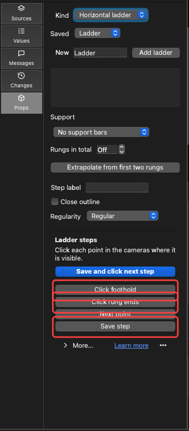

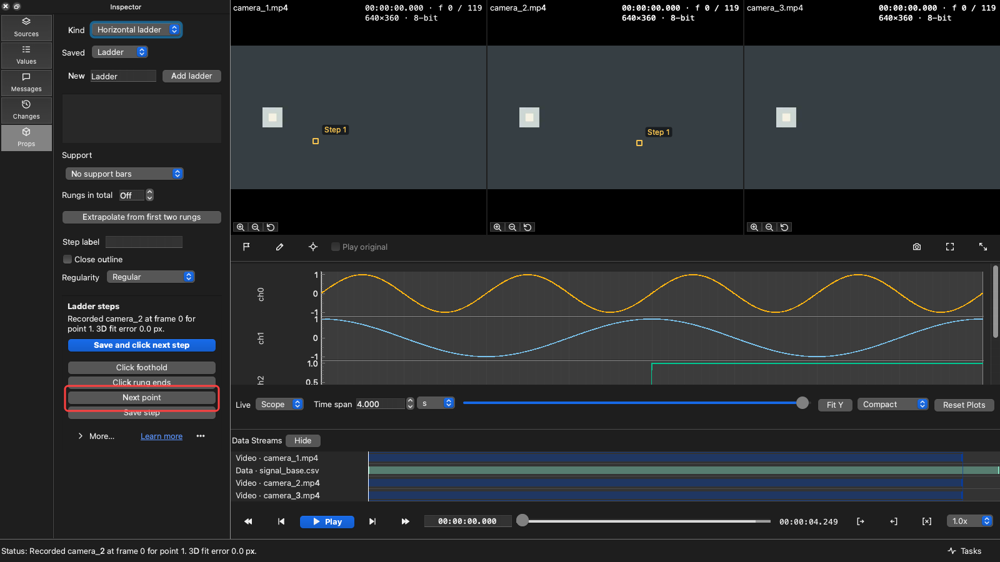

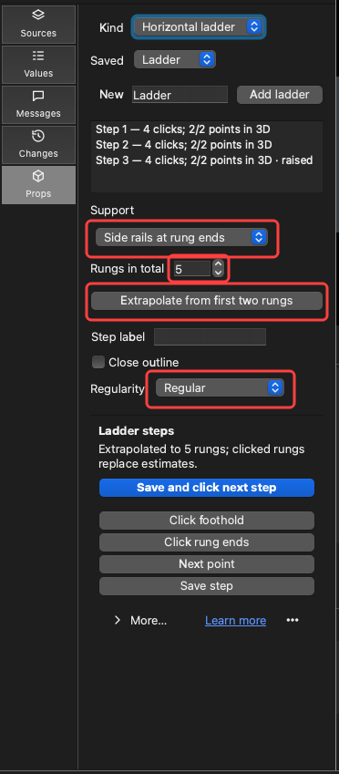

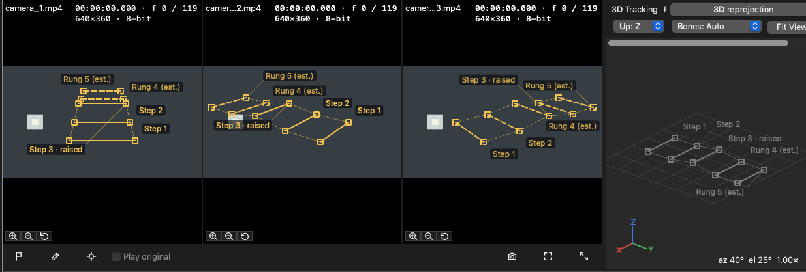

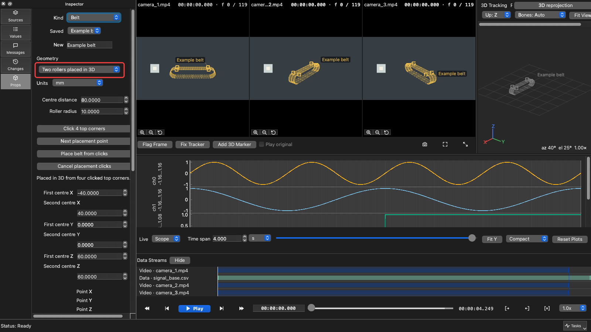

For a **treadmill belt**, measure the apparatus first: the distance between the two roller axles and
the roller radius. Clicks then say where the belt is; your measurements say how big it is.

With two calibrated cameras, choose **Two rollers placed in 3D**, enter **Centre distance** and
**Roller radius**, and choose **Click 4 top corners**. Click a top corner near the first roller in
two cameras, choose **Next placement point**, click the other corner on that roller's end, then the
two corners near the second roller (the first of them on the first corner's side). Choose **Place
belt from clicks**, then **Save belt geometry**. The corners give the top plane (facing the
cameras), the direction of travel, the width and the belt's middle; the typed centre distance and
radius give its size. Leave **Centre distance** at **From clicks** to use the clicked span instead.
All four corners stay marked in every camera, and the status reports how flat they are. You can also
type the centres, width and top direction yourself.

With one camera, for example a side view, choose **Two rollers in one camera view**, enter **Centre
distance**, **Roller radius** and **Surface width**, choose **Click hubs and belt top**, and click
in that camera: the first roller's hub, the second roller's hub, the belt's top above the first hub
and the top above the second hub. These four points fix the view's perspective of the belt's side,
so no calibration is needed. The belt is drawn only in that camera and not placed in 3D; a belt mark
can still be tracked there with one click per frame, and travel direction X runs from hub 1 to hub 2.

In either mode the top run is flat. AvialSync draws the top and return surfaces around both
rollers. Its exact loop length is twice the centre separation plus the circumference of one roller;
the curved wraps are used for motion even though the viewer draws them as a surface mesh. Set the
travel direction along the top run. To locate a painted mark from a displacement channel, enter
its reference distance along the loop, select the channel, set **Distance per reading unit** in the
geometry's units, and choose **Bind displacement at current frame**. The top can move while the
roller centres remain fixed. The **Legacy point path** choice opens belts saved with individual
path vertices; use it only when the apparatus cannot be described by two equal rollers.

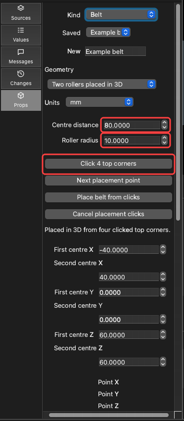

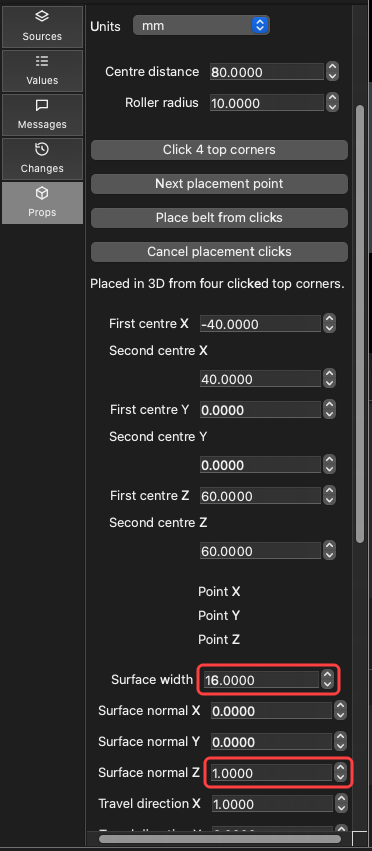

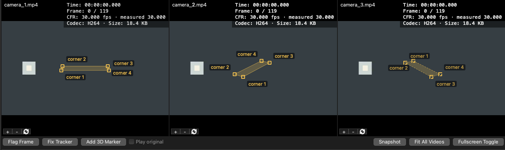

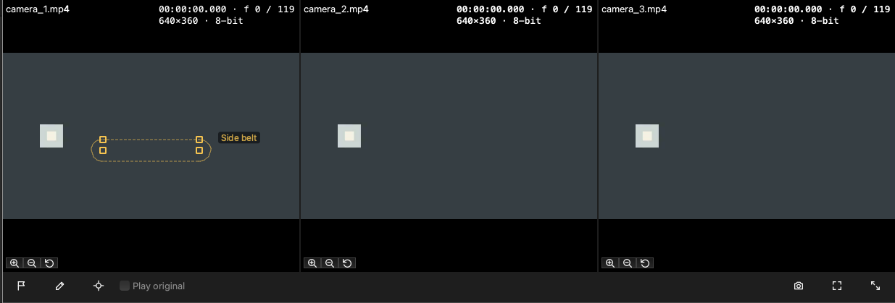

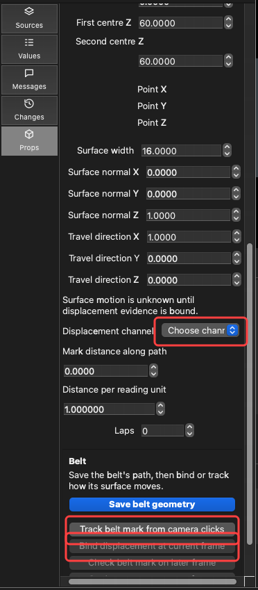

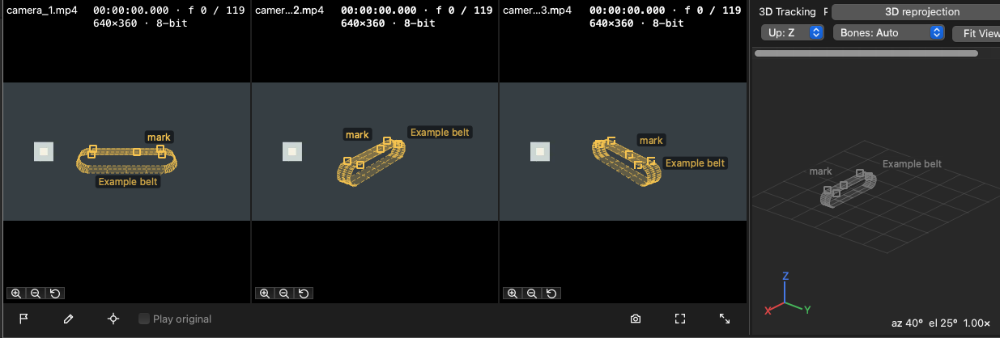

For a **ball**, enter its centre, radius and units in the calibration's 3D frame and save its
geometry. To use sensor motion, identify the surface mark's world direction on the reference frame,
select four quaternion channels (`w`, `x`, `y`, `z`) from one source, and choose **Bind orientation at
current frame**. The support path or sphere stays fixed while the identified mark follows the
measured channel values. Missing readings leave that mark hidden.

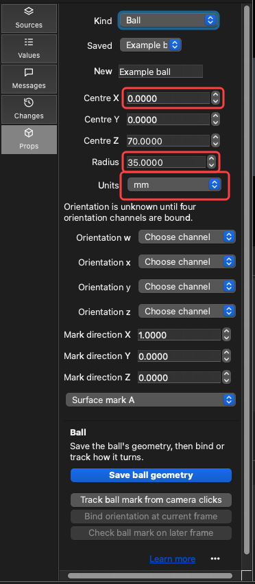

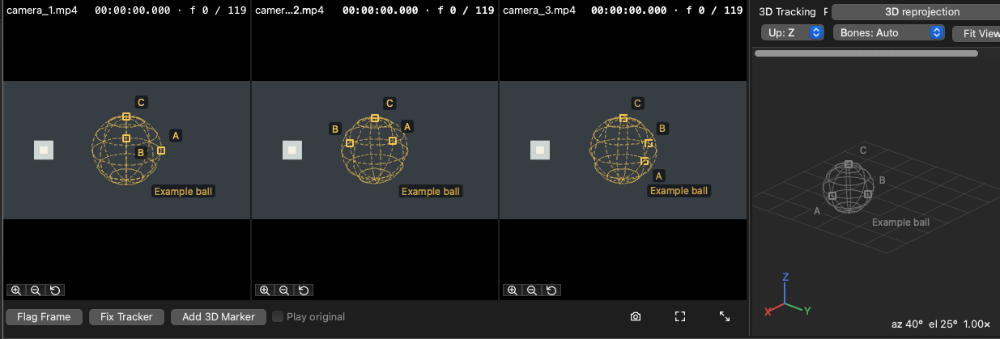

Use **Check ... mark on later frame**, then click the visible mark in a calibrated camera to save
the observed pixel and its difference from the predicted mark. Checks do not change the binding
automatically. The camera overlay and 3D view use the frame actually displayed.

For **visual-only belt tracking**, choose **Track belt mark from camera clicks** and click the same
painted mark in two calibrated cameras at the reference frame and each later frame you want to
measure. The path stays fixed; the mark appears only on frames with a valid stereo fit. On a
closed path, set the whole lap count on each observed frame to measure signed travel; a position
alone cannot reveal how many complete laps passed. For **visual-only ball tracking**, choose mark
A, B, or C and click each distinct surface mark in two calibrated cameras on the reference frame.
Repeat the same identities on later frames. Three valid marks give a 3D orientation; missing or
ambiguous observations leave it unknown. If two camera clicks disagree, check their locations and
the calibration. If a stereo-located belt mark is off the declared path, correct the path or its
units; if ball marks are off the declared sphere, correct its centre, radius or units. AvialSync
keeps the original camera clicks when you edit belt or ball geometry and checks them against the
new declaration. A belt path crossing, ball marks too close together, or marks that do not move
as one rigid sphere also leave motion unknown, with the reason shown in Props. The declared shape
does not automatically shift to fit a mark. These visual tracks use the same Props record and can
be cleared or undone. Clicking a visual mark replaces the prop's channel motion binding.

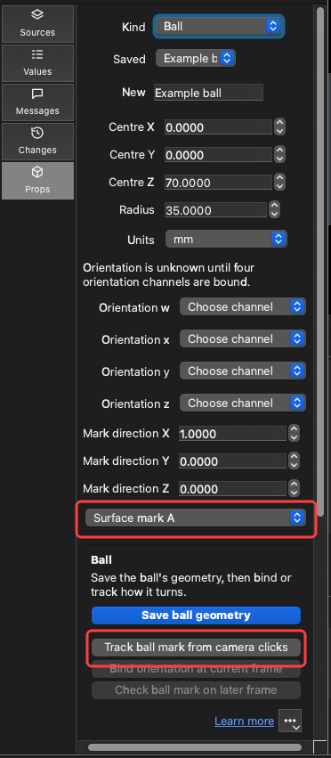

The wheel has its own workflow, described in [Placing a running wheel](#placing-a-running-wheel).

## Placing a running wheel

When the animal runs on a wheel, open **Edit → Add Physical Prop…**, select **Wheel** in **Props**,
and choose **Add wheel** there. This uses the same calibrated camera-click workflow. It draws bars
over every camera and in the 3D view, turned from frame to frame by the wheel's encoder. It needs at
least two cameras and their calibration (the same one Add 3D Marker uses).

1. Give the wheel a name, the **number of bars on the whole wheel**, and the encoder channel that
   turns it. An AOL session fills in the channel for you. The bar count is required: two or three
   neighbouring bars show the spacing between bars, and only the count turns that spacing into the
   wheel's size.
2. Optionally set the **3D units** (the units your calibration was made in, usually mm) and the
   **radius to the bar centres**, measured on the rig. AvialSync reports both your radius and the
   radius the clicks imply. Check the units and bar count when they disagree.
   If they differ by more than 2×, AvialSync tries the radius implied by the clicks instead.

   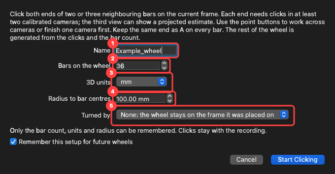
3. The Wheel page in the **Props** tab opens when you start placing a wheel. It shows **1A, 1B, 2A, 2B** and optional **3A, 3B**, with a real-click count for
   each. A and B are the two ends of one bar; keep A on the same side for every bar. Click the
   selected point in a camera to place a labelled ring there. **Next Point** or any point button
   changes which end the next click places, so you can work point by point across cameras or mark
   all the points in one camera before moving to another. A camera cue names the selected point and
   whether that camera has a click.
4. Each end needs real clicks in **at least two calibrated cameras** to locate it in 3D. In an
   unclicked view, AvialSync draws a **dashed diamond labelled “projected”** at the position
   predicted by those clicks and the calibration. Click the diamond to replace the estimate with
   a real observation. The projected point is never saved as a click or used as evidence for the
   fit. If you have only one view of an end, select another point and return when a second view is
   available; that end cannot be located in 3D yet.
5. From the second bar on, the whole wheel is generated after each click and drawn **dashed** as
   a preview. There is no separate Generate step. While it is generating, the Wheel page says
   **Generating wheel…**, and the status bar and **Tasks** panel show the job. A notification
   says when the wheel is first generated, and the Wheel page shows how far the clicks sit from it. Use **Flip Side** (in the step panel's
   **⋯** menu) if the wheel is drawn on the wrong side of the bars, **Undo Click** to take a click back, and **Done Labelling** to save
   the wheel. **Done Labelling** becomes available when **2B** has its second camera click, that is,
   once both ends of bars 1 and 2 have two camera clicks each. It stays available while you label
   bar 3, which is optional and can improve the fit. You can finish with bar 3 only partly clicked:
   those clicks are saved, and the fit uses the two complete bars. If a complete bar 3 does not
   agree with bars 1 and 2, for example because its ends were clicked the other way round, the
   Wheel page says it was left out of the fit. Its clicks are still saved.
   **Done Labelling** exits click mode and is one undo step; **Discard Clicks**, last in the **⋯** menu, exits
   without saving. **More…** shows the legend for clicks and projected estimates.

   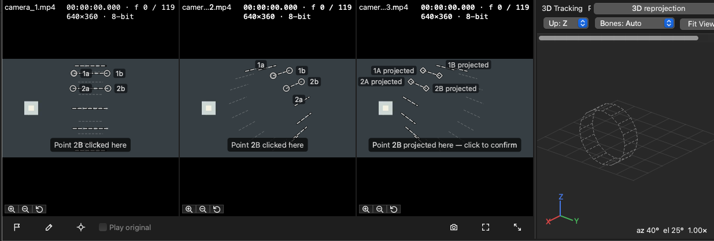

   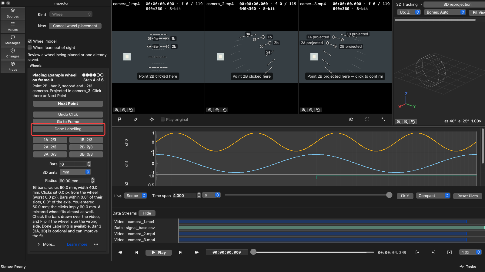

   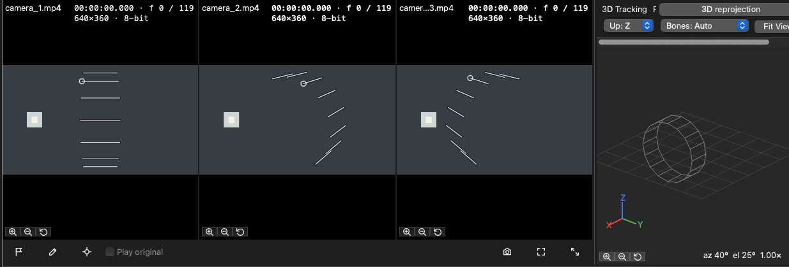

The wheel uses the accepted bars as neighbours in click order and remains visible even when it fits
poorly. All real clicks remain saved, including a third bar left out of the fit. A poor fit is
labelled **Poor fit** on the Wheel page, with how far your clicks sit from it; check the clicked bar
ends, the 3D units and the calibration. **Done Labelling** still saves it, and a notification offers
**Re-place**. If you entered a radius more than 2× from what the clicks imply, AvialSync tries a
click-derived radius; the tab says when it uses it. If no other fit exists, the contradicted fit
remains visible for review. The tab also notes when the two radii are about 10× or 100× apart, which
usually means the **3D units**
are wrong, for example cm entered for a calibration in mm. To fix a placed wheel, change its
**3D units** or **Radius** on the Wheel page: it is re-fitted from your original clicks.

Until you check it, the direction the encoder turns the wheel is **assumed**. Go to a frame a few
turns away, select **Verify Here** on the Wheel page, and click any bar end in any camera. Two
such checks measure the direction; the Wheel page says which it is and how far off the checks
were.

The wheel's bars are thin lines, never points, so they are not mistaken for tracking. Bars behind
the side plate are hidden unless you turn on **View → Overlays → Wheel bars out of sight**. The
**Wheel model** and **Wheel bars out of sight** check boxes at the top of the Wheel page are the
same switches as those View → Overlays entries. Bar count,
units, radius, direction and ratio can be changed on the Wheel page at any time; each change
re-fits the wheel from your original clicks and is one undo step.

**Bar diameter** sets how thick the bars are. In the 3D view the bars become solid cylinders of
that diameter; the camera views keep their plain bar lines. If you entered the wheel's radius as
measured on the rig, type the diameter in the same real units, e.g. 0.3 for a 3 mm bar with the
radius in cm. AvialSync converts it with the ratio between the radius you measured and the one your
clicks imply, and the Wheel page shows that ratio. Without a measured radius, the diameter is in the
calibration's own units. Dragging only previews; releasing the slider or
typing a value keeps it, as one undo step, and it is saved with the wheel. 0 means not set.

A constant delay between the encoder and the cameras goes in the wheel's **Encoder offset**, in
seconds. It is the encoder's own offset, the same number as its row in the **Sources** tab. It
therefore moves the encoder's plots with the wheel, and is one undo step. Adjust it while
watching the bars on a frame where the wheel is turning. Each wheel is saved as
`pose-3d/<name>_prop.toml` in the recording folder, beside a 3D pose when there is one. It is
read back when the recording's videos open, even if no tracking file is loaded. For cameras in
separate subfolders, `pose-3d/` is under their shared recording folder.

The Add Wheel dialog can remember the last **bar count, 3D units and radius** in AvialSync's
preferences for future wheels. On the first use, leave **Remember this setup** checked if you want
that convenience. On later uses, **Update saved setup** is an optional choice when these values
change. A recording's wheel hint takes precedence, and encoder selection is checked against the
channels loaded in that recording. Choose **Forget saved setup** in the dialog, or reset the wheel
settings in **Preferences → Wheel Setup**, to clear those defaults. This does not remove any wheel
already saved with a recording.

## Appearance and font size

Use **View → Theme** to choose System, Dark, or Light, and **View → Font Size** to select a
system-relative text size. System follows your desktop, including a change made while AvialSync is
running, and returning to System from Dark or Light gives the appearance back to your desktop.

A switch reaches the plots — background, axis lines, tick numbers, axis titles and playhead — the
3D pose view, the pane boundaries you drag, and the controls the operating system draws, such as
scroll bars and drop-down lists.

These choices change colours, accent, and text presentation only. They do
not reset or reinterpret your shared time, seek bar, plot navigation, playback, layout, or loaded
data. A larger font may naturally reflow labels to remain readable.
