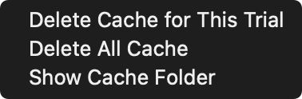
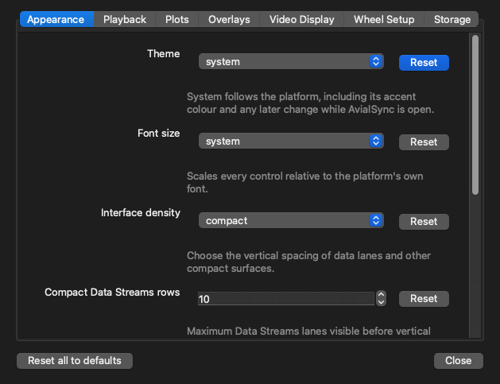
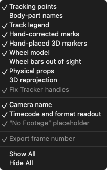
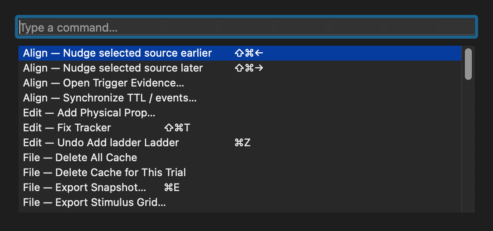
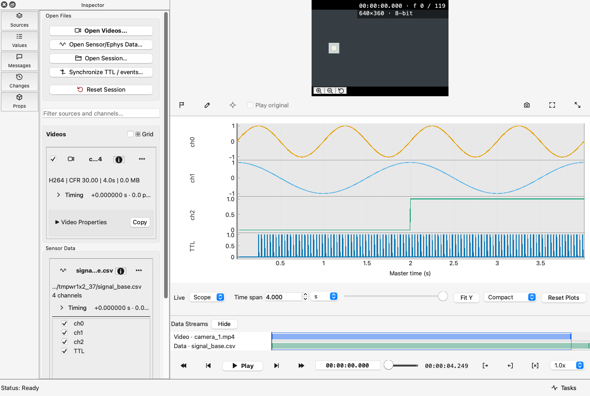

# Sessions, proxies, and the 3D view

The parts of day-to-day use that are not alignment, annotation, or import.

## Sessions

**File → Save Session…** writes a `.avv` file recording which sources you loaded, their offsets and
drift, any accepted mappings and the evidence behind them, your annotations, and the layout. **File
→ Open Session…** restores it, and **File → Recent Sessions** lists the ones you opened last.

Use **File → Reset Session** (also the last button under **Open Files** on the **Sources** page) to close every
loaded source and clear annotations, messages, synchronization evidence, and timeline state before opening or dropping a
different recording. It does not modify your recordings, their cache, or an already-saved `.avv` file,
and **Edit → Undo** brings the workspace back.

A session stores *paths*, not copies. Your recordings stay where they are and are never modified,
which means a session is small and safe to share with a colleague — provided they can reach the
same files.

The session is also written automatically: periodically while you work, before the window closes,
and before a video pane is torn down. That last one is deliberate: losing a session
mid-experiment because a source was removed would cost everything since the last save.

### When files have moved

Opening a session whose files are no longer where they were shows the **Missing Files** dialog. Each
missing entry gets a **Browse…** button to point at its new location; the rest of the session loads
around it. A session with one moved file is not a broken session, so it does not refuse to open.

## The cache

Imported data is cached in one folder of AvialSync's own, never beside your recordings: on macOS
`~/Library/Caches/avialsync`, on Windows `%LOCALAPPDATA%\avialsync\Cache`, on Linux
`~/.cache/avialsync`. Everything in it is rebuilt from your files when needed, so deleting it costs
only the time a re-import takes. **File → Cache** offers three commands:

- **Delete Cache for This Trial** deletes the cached imports of every file in the loaded trial's
  folder, then reloads the trial from the original files. What you had open, your offsets, markers
  and unsaved changes all come back as they were.
- **Delete All Cache** deletes the cached imports of every recording you have opened.
- **Show Cache Folder** opens the folder in your file manager.

Your own work is never in the cache: tracking corrections, identity swaps, custom markers and
physical props are saved beside the data they describe, and sessions where you save them. See
[Data handling](../technical/data-handling.md) for which file is which.

## Proxies

**File → Generate Proxy…** re-encodes a video so every frame is a keyframe.

Scrubbing normally costs one seek plus however many frames sit between the nearest keyframe and the
one you want. On long-GOP footage — a transcode with 250 frames between keyframes — that is the
difference between instant and noticeably slow. In a proxy there is nothing to decode forward: a
seek costs exactly one frame wherever it lands.

Worth doing for long-GOP or heavily compressed footage. Not worth doing for all-intra recordings,
which are already every-frame-keyframe and where a proxy would only cost disk. The lab's own
high-speed footage is usually already all-intra.

The proxy is written beside the source with a `_proxy` suffix, generation runs in the background
with progress, and it can be cancelled — a cancelled proxy deletes its partial file, so
nothing is left behind that looks finished.

## The 3D tracking view

Any complete channel triplet named `point_x`, `point_y`, and `point_z` becomes one point in the 3D
pane. Incomplete triplets stay ordinary time-series plots.

- **Drag** with the left mouse button to orbit.
- **Wheel** to zoom.
- **Fit View**, or a double-click in the view, re-frames the current pose.
- Drag the vertical splitter to give the 3D pane or the videos more room.

The pane draws the pose at the current time only — it never scans or renders a whole trajectory on a
clock tick.

Connections between points come from the session when it declares a skeleton — for an AOL folder,
that is the `skeleton:` block in `trial_config.yml`. An AOL session that declares none falls back to
the rig's own chain, from one toe up the forelimb to the head bar and down the other side, using
only the body parts that session's EKS export contains. When neither applies, AvialSync detects a
skeleton from the movement itself: two markers that keep the same distance apart
however the animal moves are on one rigid segment, and those are the pairs it joins. A detected
skeleton is drawn **dashed**, thinning as it runs away from the topmost point, and the pane says
`detected` beside the point count — it is a reading of your data, not something the recording
claimed. Names are never used to decide anatomy. Use **Bones:** in the pane header to keep the
detected skeleton (`Detected`), turn bones off entirely (`Off`), or return to `Auto`, which prefers
whatever the session declared.

## Two-photon imaging

Open an `.h5`, `.hdf5`, `.tif` or `.tiff` stack with **Open 2P Imaging…** on the Sources page or
in the File menu, or drop it on the window. The imaging pane appears below the 3D view (or alone
in that column) and shows the frame whose acquisition interval contains the playhead, exactly as
a video pane does. If the file leaves something open — which dataset, the axis order, which depth
plane, or the frame rate — AvialSync asks once and saves your answer with the session.

- **Ch 1, Ch 2, …** show or hide each channel. Visible channels are added together in the colour
  named beside each (green and magenta by default for two), so signal present in both appears
  white. Change a channel's colour from its list.
- **Brightness** and **Contrast** act per channel. Both start from levels measured from the data,
  ignoring the brightest and darkest 0.5 % of pixels; **Auto levels** measures again from the
  picture now shown and returns the sliders to the middle.
- **Average** shows the mean of the current frame and that many frames either side: **Off**, then
  ±1 (3 frames), ±2 (5 frames), … up to ±15 (31 frames). Because the window is centred,
  averaging smooths noise without moving any event in time; at the start and end of the stack it
  uses the frames that exist. Type a value and press Enter, or step with the arrows.
- **Offset** and **Drift** place the stack on the session clock, like any other source.
- **Zoom** with the strip in the picture's bottom-left corner (zoom in, zoom out, reset), the
  same buttons the video and 3D panes carry, or with the scroll wheel around the cursor. Drag
  with the middle button to pan a magnified picture; double-click to fit it again. Each pane
  keeps its own zoom.

An NWB file opens each of its image series here. In NWB a `TwoPhotonSeries` or `OnePhotonSeries`
with a third frame axis holds depth planes, not channels, so AvialSync asks which plane to show;
NWB records each optical channel as its own series, chosen from the list at the top of the pane.

Display changes are undoable and saved with the session; the raw pixels are never changed. Only
the frames needed for the current picture are read from disk, so a stack does not need to fit in
memory.

## Plot navigation

Plots are a fixed oscilloscope-style window, not a scrolling strip. The trace fills left to
right and restarts at the left edge when the window completes.

- **Time span** sets the span, in `ms`, `s`, `min`, or `h`. Pick the unit first: a smaller unit
  gives fine control, a larger one gives coarse.
- The single slider below the plots sets the visible span and controls every row together. Rows do
  not zoom or scroll independently — they share one time axis because comparing them is the point.
- **Reset Plots** (`Ctrl+0`) returns to the full loaded timeline and refits every visible plot.
- **Fit Y** fits and holds the vertical range of every visible channel.
- **Rows** sets one height for every row: Compact, Comfortable, or Large.
- The small **×** beside a plot hides that row, which also unchecks it in the left panel.

Everything drawn goes through a decimation pyramid, so a 180-million-sample channel draws one
column per pixel instead of attempting every point. Gaps in the data are drawn as breaks, and NaN
is skipped, never plotted as zero.

## Undoing what you did

**Edit → Undo** (`Ctrl+Z`) and **Redo** (`Ctrl+Shift+Z`) cover every change you make to a session:
an offset, an accepted mapping, a flagged frame, a channel you hid, a tracking correction. The Edit
menu names the specific thing it is about to reverse, so you can tell what `Ctrl+Z` will take back
before pressing it.

Loading a file is not an edit and does not enter the undo history. Neither does anything that only
affects appearance.

## Nothing blocks you, and nothing is lost on quit

AvialSync never puts a dialog between you and a file, and never asks you to save before doing
something else.

- **A damaged or partly-unreadable file still opens**, as far as it can be read, and reports what it
  could not read rather than refusing the whole thing.
- **Quitting always quits.** There is no "save your changes?" prompt in front of Open, a drag and
  drop, Open Recent, or the close button, and a wedged import cannot trap you in a window that
  refuses to close. A recovery snapshot is written on quit and on each autosave instead.
  **File → Recover Unsaved Work…** loads it back whenever you want it — greyed out, with the reason
  in its tooltip, when there is nothing to recover. Recovering loads the work as an unsaved session,
  so the title keeps its `[*]` until you save it somewhere you chose.
- **A launch is quiet unless you ask otherwise.** Because every quit writes a fresh snapshot, being
  told about it at launch means a notification to clear most times you start the application, so
  **Offer unsaved work at launch** under **Preferences → Storage** is off by default. Turning it on
  adds a line to the notification strip naming when the work is from, with a **Restore** button
  beside it; **dismissing that offer declines it without deleting anything**. Either way the
  snapshot is written, kept, and reachable from the File menu — the preference changes whether you
  are told, not whether you are protected.
- **Long work is never modal.** Imports, proxy generation, and exports report in the status area and
  **Tasks** in the status bar, with a cancel where the work supports one, and you can keep using the window
  while they run.

## Preferences

**File → Preferences…** — in the File menu on Windows, macOS and Linux alike, and on ⌘, / Ctrl+, —
collects everything configurable in one dialog, generated from the
application's own settings list, so each entry carries its explanation and its own **Reset to
default**. It holds the theme and font size, the colour-vision-safe trace palette, whether the A–B
range loops, live plot presentation, whether body-part names are drawn by default, whether display
levels for high-bit-depth video are chosen automatically, the remembered wheel setup (bar count, units
and radius), the autosave interval, and whether unsaved work from a previous run is offered at launch.

The View menu still offers theme, font size, and time display directly; they are the same settings,
not a second copy.

## Overlays on the video

**View → Overlays** switches every graphic drawn over a camera view: tracking points, body-part
names, the track legend, hand-corrected marks, the camera name, and the timecode and format
readout. Anything a plugin draws appears here too — nothing is drawn over your video that you
cannot account for.

Right-click a video pane and use **Overlays on this camera** to override one camera without changing
the others; **Follow the View menu** puts it back. Overlay choices are remembered with the session.

Two are listed but cannot be switched off, and say why when you ask: the **No Footage** placeholder,
because hiding it would leave an empty pane looking like a camera that simply had nothing to show,
and the **Fix Tracker handles**, because hiding them would leave that mode nothing to grab.

## Named layouts

**View → Workspace → Save Current Layout…** stores the window geometry, every splitter position, where the inspector panel is docked or floating, and
the selected inspector page under a name; picking that name later restores it. Aligning two
recordings wants tall plots and small video, and checking a tracking overlay wants the opposite —
this is so you do not rearrange the splitters each time.

A layout belongs to you and your screen, not to the recording, so workspaces are kept with your
application settings rather than in the `.avv` file. **Delete Layout…** removes one.

**View → Detach Plots** moves the plots into their own window, for a second display. If a panel ends
up somewhere you cannot reach — floated onto a screen that has since been unplugged, say — **View →
Bring Panels Back** re-docks every panel and moves any stray window back onto this screen.

## Time display

**View → Time Display** chooses how times are written in the time readout, the plot axes, and the
Messages and Changes tabs: **Relative (HH:MM:SS)** from the start of the recording, **UTC**, or
**Local time of day**. It changes the label only; the shared timeline and every alignment stay as
they are. A recording folder that declares its own wall clock switches the display to
UTC when it opens.

## Finding a command

**Help → Commands…** opens a searchable list of everything the application can do, with each entry's
current shortcut beside it. Type part of a name to filter. It is built from the live menu actions,
so it cannot list a command that does not exist or miss one that does — useful for the overlay
switches in particular, which are otherwise three levels into a menu.

## The Help menu

- **Review Workflow…** opens a checklist for checking timing, alignment, and observations.
- **Commands…** and **Keyboard Shortcuts…** are described above and below.
- **Documentation** opens this site.
- **Report a Problem…** copies this build's version details to the clipboard and opens the issue
  tracker, so you can paste them into the report.
- **Check for Updates** opens the changelog. The installers are not code-signed and do not update
  themselves.
- **Cite AvialSync…** shows the citation for the release you are running.
- **Diagnostics…** shows what this machine reported: the decoder, the platform, and any plugin that
  failed to load and why.
- **About AvialSync** shows the version and licence (in the application menu on macOS).

## Keyboard shortcuts

**Help → Keyboard Shortcuts** lists every registered shortcut, grouped by category, read from the
actions themselves — so it is accurate for the version you are running, unlike a list in a
document that drifts. **Shortcuts can be rebound there**: your choice is stored per action and
layered over the default, so a later release that changes a default still reaches you if you never
expressed a preference for that one.

The ones worth knowing without looking:

| Key | Action |
|---|---|
| `M` | Flag the current frame |
| `Ctrl+E` | Export snapshot |
| `[` and `]` (or `I` and `O`) | Mark the start and end of a range |
| `F11` (`Ctrl+Cmd+F` on macOS) | Toggle fullscreen on the active video |
| `J` / `K` / `L` | Shuttle back, pause, shuttle forward |
| `Ctrl+Z` / `Ctrl+Shift+Z` | Undo, redo |
| `Ctrl+Shift+T` | Fix Tracker |
| `Ctrl+Shift+←` / `→` | Nudge the selected source earlier or later |

`Ctrl+V` and `Ctrl+D` are deliberately *not* bound to opening files — those belong to paste and
duplicate everywhere else, and rebinding them would be a trap. Opening uses `Ctrl+Shift+V` for video
and `Ctrl+Shift+D` for data.

## Appearance

**View → Theme** offers System, Dark, or Light. **View → Font Size** offers a system-relative size.

System follows your desktop, including a change you make while AvialSync is running, and switching
back to System from Dark or Light hands the appearance to your desktop again.

A switch reaches everything on screen: the plot background, axis lines, tick numbers and axis
titles, the playhead, trace and marker colours, the 3D pose view, the pane boundaries you drag, and
the controls the operating system draws for us — scroll bars, check boxes, drop-down lists, and the
window frame.

These change colours and text only. They do not reset or reinterpret your shared time, seek bar,
plot navigation, playback state, layout, or loaded data — an appearance change is never allowed to
disturb what you are looking at.

Text drawn over video is the one deliberate exception: the camera label, the on-screen readout and
the "No Footage" placeholder stay light on a dark backing in every appearance, because they sit on
your footage rather than on an application surface. A video frame does not get lighter because the
application did.

Trace colours come from a palette checked in colour-blindness-simulated space, and colour never
carries meaning on its own — a trace is always identified by its label as well. If you prefer the
older colours, turn off **Colour-vision-safe trace palette** in Preferences.
